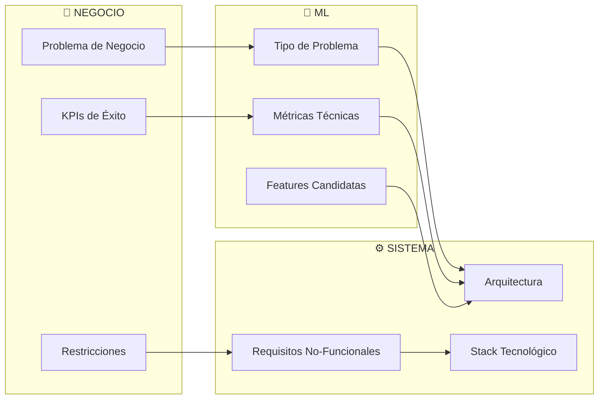
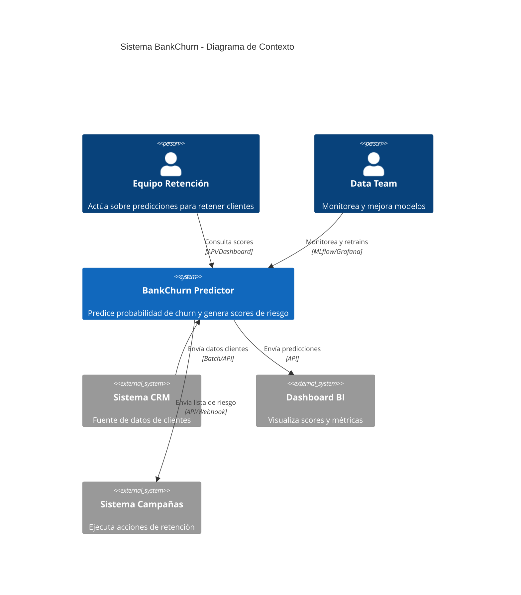
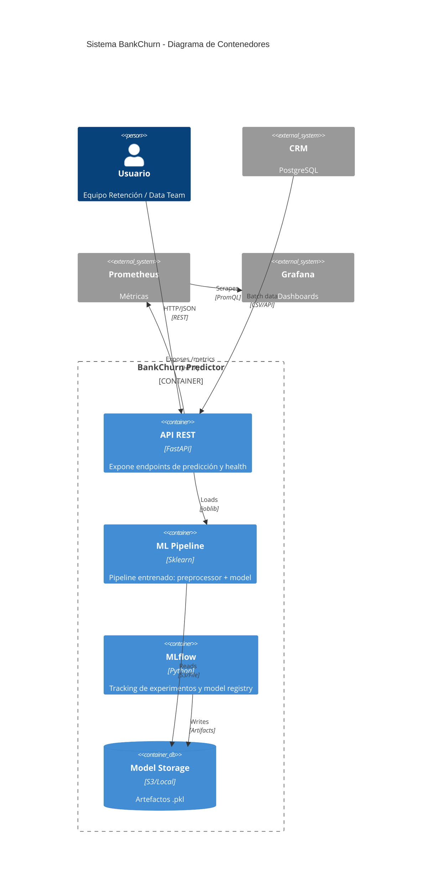
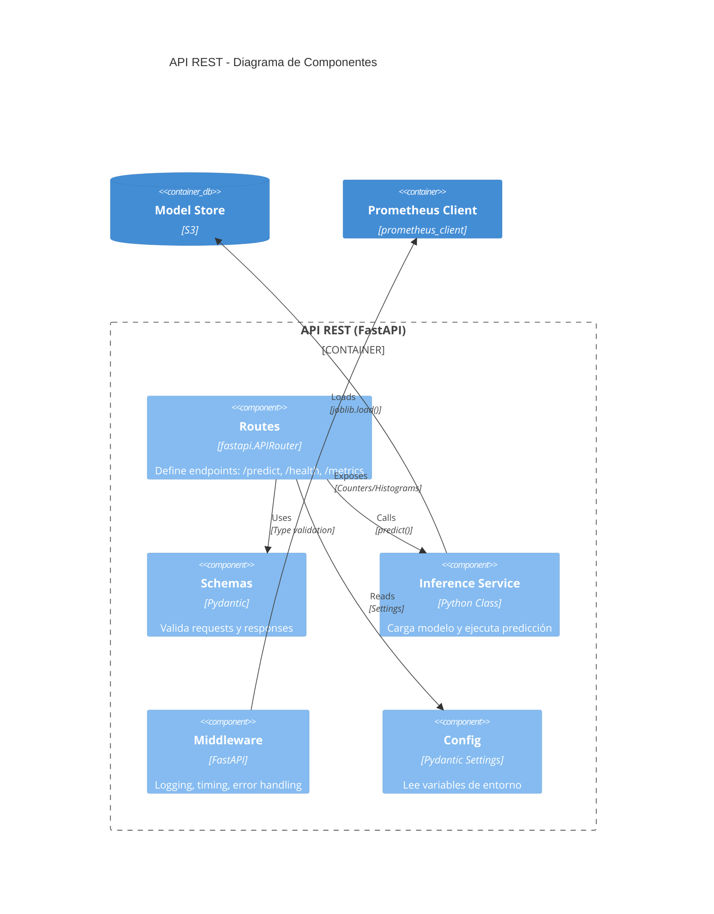
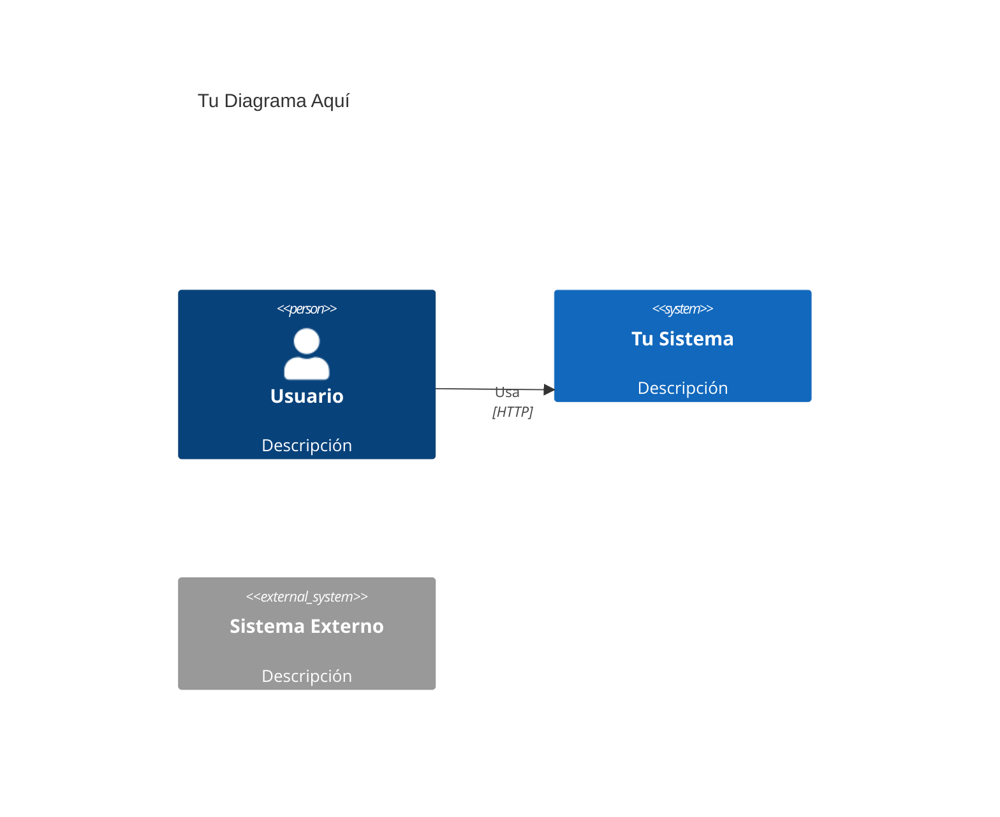
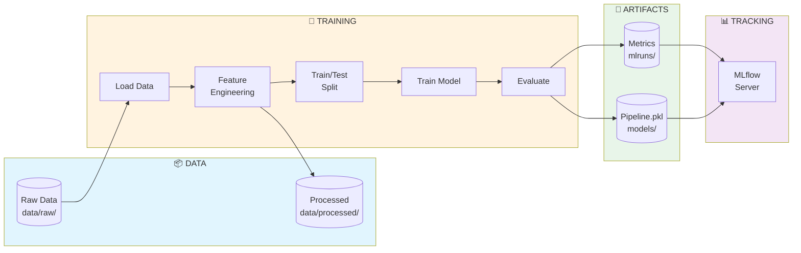
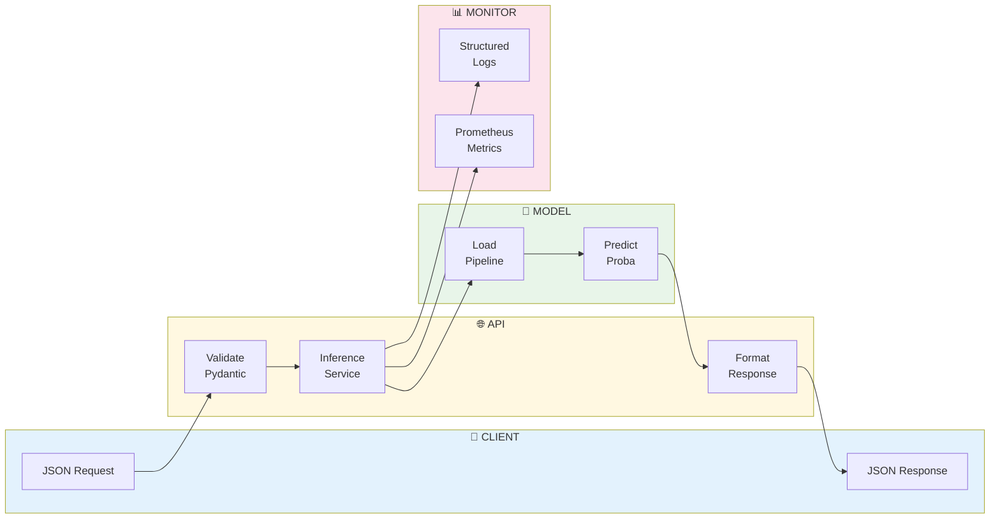
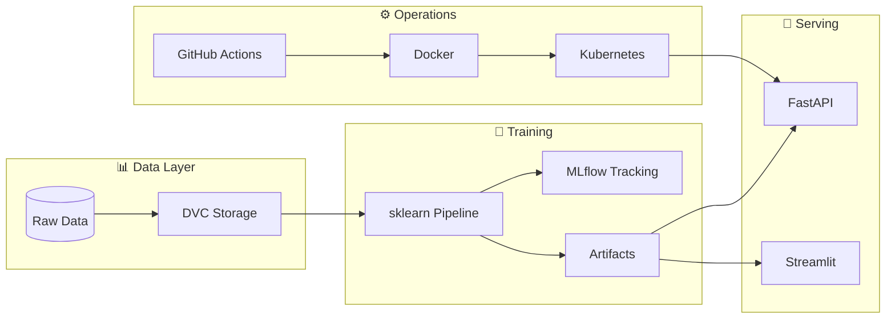
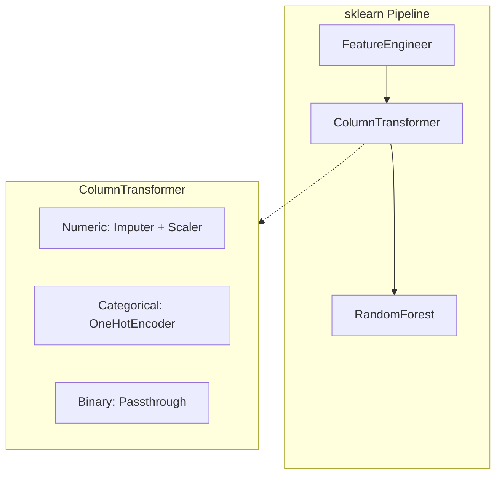
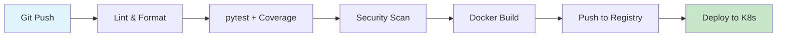

# ════════════════════════════════════════════════════════════════════════════════
# MÓDULO 02: DISEÑO DE SISTEMAS ML
# Del Problema de Negocio a la Arquitectura Técnica
# Guía MLOps v5.0: Senior Edition | DuqueOM | Noviembre 2025
# ════════════════════════════════════════════════════════════════════════════════

<div align="center">

# 📐 MÓDULO 02: Diseño de Sistemas ML

### Del Problema de Negocio a la Arquitectura Técnica

*"Un arquitecto Senior no dibuja casas bonitas; diseña sistemas que sobreviven*
*a terremotos, a cambios de requisitos y a desarrolladores que se van."*

| Duración             | Teoría               | Práctica             |
| :------------------: | :------------------: | :------------------: |
| **5-6 horas**        | 40%                  | 60%                  |

</div>

---

<a id="00-prerrequisitos"></a>

## 0.0 Prerrequisitos

- Haber completado **[01_PYTHON_MODERNO](01_PYTHON_MODERNO.md)** (al menos type hints + estructura `src/`).
- Entender el objetivo de los 3 proyectos del portafolio y qué problema de negocio atacan.
- Poder leer diagramas simples (cajas y flechas) y discutir trade-offs.

---

<a id="01-protocolo-e-como-estudiar-este-modulo"></a>

## 0.1 🧠 Protocolo E: Cómo estudiar este módulo

- **Antes de diseñar**: abre **[Protocolo E](study_tools/PROTOCOLO_E.md)** y define tu *output mínimo* (ej: “ML Canvas completo + 2 ADRs”).
- **Mientras lo haces**: si te atoras >15 min (ej: métricas, restricciones, diagrama), registra el bloqueo en **[Diario de Errores](study_tools/DIARIO_ERRORES.md)**.
- **Al cerrar la semana**: usa **[Cierre Semanal](study_tools/CIERRE_SEMANAL.md)** para decidir qué mejorar (claridad, trade-offs, consistencia con código).

---

<a id="02-entregables-verificables-minimo-viable"></a>

## 0.2 ✅ Entregables verificables (mínimo viable)

Al terminar este módulo, deberías poder mostrar (en al menos 1 proyecto del portafolio):

- [ ] **1 ML Canvas** escrito (1 página) con métricas de negocio/modelo/sistema.
- [ ] **1 diagrama de arquitectura** (C4: Contexto + Contenedores).
- [ ] **2 ADRs** con alternativas y trade-offs (ej: API vs batch, DVC vs alternativa).

---

<a id="03-puente-teoria-codigo-portafolio"></a>

## 0.3 🧩 Puente teoría ↔ código (Portafolio)

Para que esto cuente como progreso real, fuerza este mapeo:

- **Concepto**: traducción negocio→ML / C4 / ADR
- **Archivo**: `docs/ML_CANVAS.md`, `docs/ARCHITECTURE.md`, `docs/decisions/ADR-001.md`
- **Evidencia**: diagrama + decisiones justificadas + métricas cuantificadas (no “mejorar la experiencia”).

---

## 📋 Contenido

- **0.0** [Prerrequisitos](#00-prerrequisitos)
- **0.1** [Protocolo E: Cómo estudiar este módulo](#01-protocolo-e-como-estudiar-este-modulo)
- **0.2** [Entregables verificables (mínimo viable)](#02-entregables-verificables-minimo-viable)
- **0.3** [Puente teoría ↔ código (Portafolio)](#03-puente-teoria-codigo-portafolio)
- [ADR de Inicio: ¿Por Qué Diseñar Antes de Codificar?](#adr-inicio)
- [2.1 Traducción Negocio → ML](#21-traduccion-negocio--ml)
- [2.2 ML Canvas](#22-ml-canvas)
- [2.3 Arquitectura con el Modelo C4](#23-arquitectura-con-el-modelo-c4)
- [2.4 Diagrama de Flujo de Datos](#24-diagrama-de-flujo-de-datos)
- [2.5 Architecture Decision Records (ADRs)](#25-architecture-decision-records-adrs)
- [2.6 Ejercicio Integrador](#26-ejercicio-integrador-disena-tu-sistema)
- [Errores habituales y cómo depurarlos](#errores-habituales)
- [2.7 Autoevaluación](#27-autoevaluacion)

---

<a id="adr-inicio"></a>

## 🎯 ADR de Inicio: ¿Por Qué Diseñar Antes de Codificar?

```
╔═══════════════════════════════════════════════════════════════════════════════╗
║  ADR-002: Diseño Obligatorio Antes del Código                                 ║
╠═══════════════════════════════════════════════════════════════════════════════╣
║                                                                               ║
║  CONTEXTO:                                                                    ║
║  El 73% de proyectos ML que fallan lo hacen por problemas de DISEÑO,          ║
║  no de algoritmos (Sculley et al., "Hidden Technical Debt in ML Systems").    ║
║                                                                               ║
║  DECISIÓN:                                                                    ║
║  Todo proyecto debe completar: ML Canvas + Diagrama de Arquitectura +         ║
║  ADRs para decisiones técnicas clave ANTES de escribir código.                ║
║                                                                               ║
║  CONSECUENCIAS:                                                               ║
║  (+) Alineamiento stakeholders-equipo desde el inicio                         ║
║  (+) Documentación de trade-offs para futuros desarrolladores                 ║
║  (+) Menor retrabajo por requisitos mal entendidos                            ║
║  (-) Añade 1-2 semanas al inicio del proyecto                                 ║
║                                                                               ║
╚═══════════════════════════════════════════════════════════════════════════════╝
```

### Lo Que Lograrás en Este Módulo

1. **Traducir** problemas de negocio a problemas de ML con métricas claras
2. **Completar** un ML Canvas profesional
3. **Diseñar** arquitectura usando el modelo C4
4. **Documentar** decisiones técnicas con ADRs
5. **Crear** un diagrama de flujo de datos

---

<a id="21-traduccion-negocio--ml"></a>

## 2.1 Traducción Negocio → ML (El Arte del Senior)

### El Anti-Patrón: "Tengo Datos, Voy a Hacer ML"

```
╔═══════════════════════════════════════════════════════════════════════════════╗
║                         ⚠️ EL ERROR DEL JUNIOR                                ║
╠═══════════════════════════════════════════════════════════════════════════════╣
║                                                                               ║
║   JUNIOR:                                                                     ║
║   "Tengo datos de clientes → Voy a probar XGBoost → Algo saldrá"              ║
║                                                                               ║
║   PROBLEMA:                                                                   ║
║   • No sabe qué métrica optimizar (¿accuracy? ¿F1? ¿costo de negocio?)        ║
║   • No sabe si el modelo genera valor                                         ║
║   • No puede priorizar features porque no entiende el negocio                 ║
║   • Cuando el proyecto "termina", nadie lo usa                                ║
║                                                                               ║
╠═══════════════════════════════════════════════════════════════════════════════╣
║                         ✅ EL ENFOQUE DEL SENIOR                              ║
╠═══════════════════════════════════════════════════════════════════════════════╣
║                                                                               ║
║   SENIOR:                                                                     ║
║   "El banco pierde $2M/año por churn → Predecir top 10% de riesgo →           ║
║    Campaña de retención → ROI esperado $400K → Métricas:                      ║
║    Precision@10% > 50%, AUC > 0.85, Latencia < 100ms"                         ║
║                                                                               ║
║   VENTAJAS:                                                                   ║
║   • Métrica clara conectada a $$$                                             ║
║   • Sabe cuándo el modelo es "suficientemente bueno"                          ║
║   • Puede justificar inversión en infraestructura                             ║
║   • El proyecto genera valor medible                                          ║
║                                                                               ║
╚═══════════════════════════════════════════════════════════════════════════════╝
```

### Framework de Traducción: Negocio → ML → Sistema



### Tabla de Traducción (Ejemplos)

| Problema de Negocio | Tipo ML | Métrica Negocio | Métrica Técnica | Requisito Sistema |
| :------------------ | :------ | :-------------- | :-------------- | :---------------- |
| Reducir abandono de clientes | Clasificación Binaria | $ retenido/año | AUC-ROC, Precision@K | Batch diario o API < 100ms |
| Estimar precio de vehículos | Regresión | % error en valuación | RMSE, MAPE | API síncrona < 200ms |
| Detectar fraude en tarjetas | Anomaly Detection | $ fraude evitado | Precision, Recall | Streaming < 50ms |
| Recomendar productos | Ranking/RecSys | Lift en ventas | NDCG@10, MAP | API < 100ms, cold-start handling |
| Predecir demanda | Series Temporales | % reducción stockout | MAPE, Bias | Batch semanal |

### 🧠 Mapa Mental de Conceptos: Traducción Negocio → ML

```
                     ╔══════════════════════════════════════════════════╗
                     ║       TRADUCCIÓN NEGOCIO → ML → SISTEMA          ║
                     ╚══════════════════════════════════════════════════╝
                                            │
        ┌───────────────────────────────────┼───────────────────────────────────┐
        ▼                                   ▼                                   ▼
┌───────────────────┐             ┌───────────────────┐             ┌───────────────────┐
│  🏢 NEGOCIO       │             │  🧠 ML            │             │  ⚙️ SISTEMA       │
└───────────────────┘             └───────────────────┘             └───────────────────┘
       │                                 │                                 │
├─ Problema ($$$)              ├─ Tipo de problema           ├─ Batch vs Real-time
├─ KPIs de éxito               ├─ Métrica técnica            ├─ Latencia requerida
├─ Restricciones               ├─ Features candidatas        ├─ Throughput
└─ ROI esperado                └─ Baseline                   └─ SLAs
```

**Términos clave que debes dominar:**

| Término | Significado | Ejemplo |
|---------|-------------|---------|
| **Problema de negocio** | Dolor cuantificable en $$$ | "Perdemos $2M/año por churn" |
| **KPI** | Indicador clave de rendimiento | Retención, conversión, ARPU |
| **Métrica de negocio** | Cómo mides el éxito | $ retenido/año |
| **Métrica técnica** | Qué optimiza el modelo | AUC-ROC, RMSE, Precision@K |
| **Baseline** | Modelo simple de referencia | Logistic Regression, promedio |
| **SLA** | Service Level Agreement | Latencia < 100ms, uptime 99.5% |

---

### 💻 Ejercicio Puente: De Problema a Solución ML

> **Meta**: Practica traducir problemas de negocio vagos a especificaciones ML concretas.

**Ejercicio 1: Cuantifica el problema**
```
Problema vago: "Queremos mejorar la satisfacción del cliente"

TU TAREA: Convierte esto en un problema cuantificable:
- ¿Cómo se mide la satisfacción actualmente?
- ¿Cuál es el valor actual?
- ¿Cuánto cuesta el problema en $$$?
```

**Ejercicio 2: Elige la métrica correcta**
```
Escenario: Hospital - predecir riesgo de readmisión
- El costo de NO detectar un paciente de riesgo es muy alto (vida)
- Hay pocos pacientes de alto riesgo (~5%)

TU TAREA: ¿Qué métrica priorizarías?
A) Accuracy  B) Precision  C) Recall  D) F1
Justifica tu respuesta.
```

<details>
<summary>🔍 Ver Soluciones</summary>

**Ejercicio 1:**
```
- Métrica: NPS (Net Promoter Score) = 32
- Problema: Clientes detractores (NPS < 7) representan 25% de abandono
- Costo: $500K/año en churn de detractores
- Objetivo: Identificar detractores antes de que abandonen → Intervención proactiva
```

**Ejercicio 2:** 
**C) Recall** es la respuesta correcta.
- En casos médicos donde el costo de un falso negativo es muy alto (no detectar un paciente de riesgo), priorizamos Recall.
- Preferimos "falsos positivos" (revisar pacientes sanos) que perder pacientes en riesgo.
- Con desbalanceo del 5%, Accuracy sería engañosa (95% solo prediciendo "no riesgo").
</details>

---

### 🛠️ Práctica del Portafolio: Traducir BankChurn

> **Tarea**: Documentar la traducción completa para el proyecto BankChurn-Predictor.

**Paso 1: Identifica los números reales (pistas guiadas)**
```
# Lee el README del proyecto
cat BankChurn-Predictor/README.md

# Busca:
# - ¿Cuál es el churn rate actual?
# - ¿Cuántos clientes hay?
# - ¿Cuál es el valor promedio de un cliente?
```

**Paso 2: Completa esta tabla**
```markdown
| Capa      | Pregunta                    | Tu Respuesta           |
|-----------|-----------------------------|------------------------|
| NEGOCIO   | ¿Qué duele?                 | ___________________    |
| NEGOCIO   | ¿Cuánto cuesta?             | $______/año            |
| ML        | ¿Qué tipo de problema?      | Clasificación _____    |
| ML        | ¿Qué métrica optimizamos?   | _____________________  |
| SISTEMA   | ¿Batch o real-time?         | _____________________  |
| SISTEMA   | ¿Latencia requerida?        | < _____ ms             |
```

**Paso 3: Crea el archivo**
```bash
# Crea docs/PROBLEM_DEFINITION.md en BankChurn-Predictor
touch BankChurn-Predictor/docs/PROBLEM_DEFINITION.md
```

---

### ✅ Checkpoint de Conocimiento: Traducción Negocio → ML

**Pregunta 1**: ¿Por qué es importante cuantificar el problema en $$$?

A) Para impresionar a los stakeholders  
B) Para saber cuándo el modelo es "suficientemente bueno" y justificar inversión  
C) Porque es requisito de sklearn  
D) Para elegir el algoritmo correcto  

**Pregunta 2**: Un e-commerce quiere predecir qué productos recomendarle a cada usuario. ¿Qué tipo de problema ML es?

A) Clasificación binaria  
B) Regresión  
C) Ranking/RecSys  
D) Anomaly detection  

**Pregunta 3**: Si el costo de un falso positivo es $1 y el de un falso negativo es $1000, ¿qué deberías priorizar?

A) Precision  
B) Recall  
C) Accuracy  
D) F1-score  

**🔧 Escenario de Debugging:**

```
Situación: Tu modelo tiene AUC = 0.95 (excelente), pero el equipo de negocio dice que "no sirve".

Al investigar, descubres:
- El modelo optimiza para clasificar correctamente a TODOS
- Pero el negocio solo puede contactar al top 10% de clientes

¿Cuál es el problema? ¿Qué métrica deberías haber usado?
```

<details>
<summary>🔍 Ver Respuestas</summary>

**Pregunta 1**: B) Para saber cuándo el modelo es "suficientemente bueno" y justificar inversión.

**Pregunta 2**: C) Ranking/RecSys. El objetivo es ordenar productos por relevancia para cada usuario.

**Pregunta 3**: B) Recall. Con costo de FN >>> costo de FP, necesitas minimizar falsos negativos.

**Escenario de Debugging**: 
- **Problema**: AUC mide discriminación global, pero el negocio solo actúa sobre el top 10%.
- **Solución**: Usar **Precision@K** o **Lift@10%** como métrica principal.
- **Lección**: Siempre pregunta "¿cómo se USARÁ el modelo?" antes de elegir métricas.
</details>

---

<a id="22-ml-canvas"></a>

## 2.2 ML Canvas: El Blueprint del Proyecto

### ¿Qué es el ML Canvas?

El **ML Canvas** es un framework de 1 página que captura todas las decisiones clave de un proyecto ML. Es como el Business Model Canvas pero para sistemas de ML.

```
╔═══════════════════════════════════════════════════════════════════════════════════════════════════════╗
║                                      ML CANVAS: BANKCHURN PREDICTOR                                   ║
╠═══════════════════════════════════════════════════════════════════════════════════════════════════════╣
║                                                                                                       ║
║  ┌───────────────────────────────────────────┐   ┌─────────────────────────────────────────────────┐  ║
║  │ 1. 🎯 PROBLEMA DE NEGOCIO                 │   │ 2. 💰 PROPUESTA DE VALOR                       │  ║
║  │                                           │   │                                                 │  ║
║  │ • El banco pierde $2M/año por clientes    │   │ • Reducir churn 20% = $400K ahorro/año          │  ║
║  │   que abandonan sin previo aviso          │   │ • Identificar top 10% clientes en riesgo        │  ║
║  │ • Equipo de retención actúa reactivamente │   │ • Tiempo de acción: de 0 días a 30 días previo  │  ║
║  │ • Costo de adquisición 5x vs retención    │   │ • Campañas personalizadas por segmento riesgo   │  ║
║  │                                           │   │                                                 │  ║
║  └───────────────────────────────────────────┘   └─────────────────────────────────────────────────┘  ║
║                                                                                                       ║
║  ┌───────────────────────────────────────────┐   ┌─────────────────────────────────────────────────┐  ║
║  │ 3. 📊 DATOS DISPONIBLES                   │   │ 4. 🔧 FEATURES CANDIDATAS                      │  ║
║  │                                           │   │                                                 │  ║
║  │ FUENTE: Sistema CRM (PostgreSQL)          │   │ DEMOGRÁFICAS:                                   │  ║
║  │ • 10,000 registros históricos (2 años)    │   │ • Age, Gender, Geography                        │  ║
║  │ • Label: Exited (0=activo, 1=abandonó)    │   │                                                 │  ║
║  │ • Frecuencia: Snapshot mensual            │   │ FINANCIERAS:                                    │  ║
║  │ • Latencia: T-1 día                       │   │ • CreditScore, Balance, EstimatedSalary         │  ║
║  │                                           │   │                                                 │  ║
║  │ CALIDAD:                                  │   │ COMPORTAMIENTO:                                 │  ║
║  │ • Nulos: < 1%                             │   │ • Tenure, NumOfProducts, HasCrCard              │  ║
║  │ • Desbalanceo: 20% churn (manejable)      │   │ • IsActiveMember                                │  ║
║  │ • Data drift: Estacional (navidad)        │   │                                                 │  ║
║  │                                           │   │ DERIVADAS (Feature Engineering):                │  ║
║  │ RESTRICCIONES LEGALES:                    │   │ • BalancePerProduct = Balance / NumOfProducts   │  ║
║  │ • GDPR: Pseudonimización requerida        │   │ • BalanceSalaryRatio = Balance / Salary         │  ║
║  │ • No usar: Raza, Religión, etc.           │   │ • TenureAgeRatio = Tenure / Age                 │  ║
║  │                                           │   │                                                 │  ║
║  └───────────────────────────────────────────┘   └─────────────────────────────────────────────────┘  ║
║                                                                                                       ║
║  ┌───────────────────────────────────────────┐   ┌─────────────────────────────────────────────────┐  ║
║  │ 5. 🤖 MODELO                              │   │ 6. 📏 MÉTRICAS DE ÉXITO                        │  ║
║  │                                           │   │                                                 │  ║
║  │ TIPO: Clasificación Binaria               │   │ NEGOCIO:                                        │  ║
║  │                                           │   │ • $ Retenido por Campaña > $400K/año            │  ║
║  │ BASELINE:                                 │   │ • Lift vs random > 3x                           │  ║
║  │ • Logistic Regression (interpretable)     │   │                                                 │  ║
║  │ • Umbral: 50% churn rate                  │   │ MODELO:                                         │  ║
║  │                                           │   │ • AUC-ROC > 0.85 (target)                       │  ║
║  │ TARGET:                                   │   │ • Precision@10% > 50%                           │  ║
║  │ • Random Forest / XGBoost                 │   │ • Recall > 60% (no perder churners)             │  ║
║  │ • Con class_weight='balanced'             │   │                                                 │  ║
║  │                                           │   │ SISTEMA:                                        │  ║
║  │ APPROACH:                                 │   │ • Latencia P99 < 100ms                          │  ║
║  │ • Train/Test split temporal (no random)   │   │ • Throughput > 100 req/s                        │  ║
║  │ • Cross-validation: TimeSeriesSplit       │   │ • Uptime > 99.5%                                │  ║
║  │ • Hyperparameter tuning: Optuna           │   │ • Coverage > 80%                                │  ║
║  │                                           │   │                                                 │  ║
║  └───────────────────────────────────────────┘   └─────────────────────────────────────────────────┘  ║
║                                                                                                       ║
║  ┌───────────────────────────────────────────┐   ┌─────────────────────────────────────────────────┐  ║
║  │ 7. ⚠️ RIESGOS Y MITIGACIONES              │   │ 8. 🚀 PLAN DE DESPLIEGUE                       │  ║
║  │                                           │   │                                                 │  ║
║  │ TÉCNICOS:                                 │   │ MVP (Semana 10):                                │  ║
║  │ • Desbalanceo → class_weight, SMOTE       │   │ • API REST (FastAPI)                            │  ║
║  │ • Data leakage → Validación temporal      │   │ • Docker container                              │  ║
║  │ • Overfitting → Regularización, CV        │   │ • Consumidor: Dashboard BI (PowerBI)            │  ║
║  │                                           │   │ • Batch scoring diario                          │  ║
║  │ OPERACIONALES:                            │   │                                                 │  ║
║  │ • Model decay → Monitoreo + retrain       │   │ V2 (Mes 3):                                     │  ║
║  │ • Data drift → Evidently/NannyML          │   │ • Kubernetes deployment                         │  ║
║  │ • Latencia alta → Caching, async          │   │ • Integración CRM real-time                     │  ║
║  │                                           │   │ • A/B testing framework                         │  ║
║  │ ÉTICOS:                                   │   │ • Reentrenamiento mensual automatizado          │  ║
║  │ • Sesgo geográfico → Fairness metrics     │   │                                                 │  ║
║  │ • Explicabilidad → SHAP values            │   │ CONSUMIDORES:                                   │  ║
║  │                                           │   │ • Equipo de Retención (principal)               │  ║
║  │                                           │   │ • Dashboard Ejecutivo (secundario)              │  ║
║  │                                           │   │ • CRM para campañas automatizadas               │  ║
║  │                                           │   │                                                 │  ║
║  └───────────────────────────────────────────┘   └─────────────────────────────────────────────────┘  ║
║                                                                                                       ║
╚═══════════════════════════════════════════════════════════════════════════════════════════════════════╝
```

### Template Vacío para Tu Proyecto

```markdown
# ML CANVAS: [NOMBRE DEL PROYECTO]

## 1. 🎯 Problema de Negocio
- ¿Qué duele?
- ¿Cuánto cuesta el problema actual?
- ¿Quién sufre?

## 2. 💰 Propuesta de Valor
- ¿Cómo ML alivia el dolor?
- ¿Cuál es el ROI esperado?
- ¿Qué decisiones habilita?

## 3. 📊 Datos Disponibles
- Fuente:
- Volumen:
- Frecuencia:
- Calidad (nulos, duplicados):
- Restricciones legales:

## 4. 🔧 Features Candidatas
- Demográficas:
- Transaccionales:
- Comportamiento:
- Derivadas (feature engineering):

## 5. 🤖 Modelo
- Tipo de problema:
- Baseline:
- Target:
- Approach de validación:

## 6. 📏 Métricas de Éxito
- Negocio:
- Modelo:
- Sistema:

## 7. ⚠️ Riesgos y Mitigaciones
- Técnicos:
- Operacionales:
- Éticos:

## 8. 🚀 Plan de Despliegue
- MVP:
- V2:
- Consumidores:
```

### 🧠 Mapa Mental de Conceptos: ML Canvas

```
                       ╔═════════════════════════════════════╗
                       ║         ML CANVAS: 8 SECCIONES      ║
                       ╚═════════════════════════════════════╝
                                            │
    ┌───────────────┬───────────────┬───────┴───────┬───────────────┐
    ▼               ▼               ▼               ▼               ▼               
┌─────────┐    ┌─────────┐     ┌─────────┐     ┌─────────┐    ┌─────────┐
│ 1.Prob  │    │ 2.Valor │     │ 3.Datos │     │ 4.Feats │    │ 5.Model │
│ Negocio │    │         │     │         │     │         │    │         │
└─────────┘    └─────────┘     └─────────┘     └─────────┘    └─────────┘
    │               │               │               │               
    ├───────────────┴───────────────┴───────────────┴───────────────┤
    ▼                                                               ▼
┌─────────────────────┐   ┌─────────────────────┐   ┌─────────────────────┐
│ 6. Métricas Éxito   │   │ 7. Riesgos          │   │ 8. Plan Despliegue  │
│ (Negocio/ML/Sistema)│   │ (Téc/Ops/Éticos)    │   │ (MVP/V2/Consumidor) │
└─────────────────────┘   └─────────────────────┘   └─────────────────────┘
```

**Términos clave que debes dominar:**

| Sección | Pregunta Clave | Error Común |
|---------|----------------|-------------|
| **1. Problema** | ¿Qué duele en $$$? | Vago: "mejorar experiencia" |
| **2. Valor** | ¿Cuál es el ROI? | Sin números concretos |
| **3. Datos** | ¿Fuente, volumen, calidad? | Asumir datos perfectos |
| **4. Features** | ¿Qué información predice? | Sin features derivadas |
| **5. Modelo** | ¿Baseline vs target? | Saltar directo a XGBoost |
| **6. Métricas** | ¿Negocio + ML + Sistema? | Solo métricas ML |
| **7. Riesgos** | ¿Técnicos, ops, éticos? | Ignorar data drift |
| **8. Despliegue** | ¿MVP y consumidores? | Plan sin fases |

---

### 💻 Ejercicio Puente: Canvas Simplificado

> **Meta**: Antes de llenar un Canvas completo, practica con las secciones críticas.

**Ejercicio: Uber Eats - Tiempo de Entrega**
```
Contexto: Uber Eats quiere predecir el tiempo de entrega para mostrarlo al usuario.

TU TAREA: Completa solo estas 4 secciones:

1. PROBLEMA DE NEGOCIO:
   - ¿Qué pasa si el tiempo mostrado es incorrecto?
   - ¿Cuánto cuesta en términos de negocio?

2. TIPO DE PROBLEMA ML:
   - ¿Clasificación, regresión, ranking?

3. MÉTRICAS:
   - Negocio: ____________________
   - ML: ________________________
   - Sistema: ___________________

4. RIESGOS:
   - ¿Qué puede salir mal?
```

<details>
<summary>🔍 Ver Solución</summary>

```
1. PROBLEMA DE NEGOCIO:
   - Si subestima: usuario frustrado, mala reseña, posible reembolso ($5-15)
   - Si sobreestima: usuario cancela y va a competidor (pérdida de orden $20+)
   - Costo: ~$X millones/año en cancelaciones y reembolsos

2. TIPO DE PROBLEMA ML:
   - Regresión (predecir minutos continuos)
   - O clasificación en buckets (15-20min, 20-30min, etc.)

3. MÉTRICAS:
   - Negocio: % órdenes entregadas dentro del tiempo mostrado
   - ML: MAE (Mean Absolute Error) en minutos
   - Sistema: Latencia <50ms (debe calcular al cargar menú)

4. RIESGOS:
   - Técnico: Modelo no captura tráfico en tiempo real
   - Operacional: Drift cuando cambian restaurantes/repartidores
   - Ético: Discriminación geográfica en tiempos
```
</details>

---

### 🛠️ Práctica del Portafolio: ML Canvas para BankChurn

> **Tarea**: Crear el ML Canvas completo para BankChurn-Predictor.

**Paso 1: Usa el template**
```bash
# Crea el archivo
touch BankChurn-Predictor/docs/ML_CANVAS.md

# Copia el template de esta guía
```

**Paso 2: Completa cada sección (pistas guiadas)**

```markdown
## 1. 🎯 Problema de Negocio
# Pista: Busca en el README cuántos clientes hay y cuál es el churn rate
# Calcula: clientes * churn_rate * valor_promedio_cliente

## 3. 📊 Datos Disponibles
# Pista: Revisa data/raw/*.csv
# ¿Cuántas filas? ¿Cuántas columnas? ¿Hay nulos?

## 6. 📏 Métricas de Éxito
# NEGOCIO: $ retenido = clientes_salvados * valor_cliente
# ML: AUC > 0.85, Recall > 60%
# SISTEMA: Latencia P99 < ___ms
```

**Paso 3: Revisa con el checklist**
```
[ ] ¿Cada sección tiene NÚMEROS, no solo palabras?
[ ] ¿Las métricas de negocio conectan con las de ML?
[ ] ¿Identificaste al menos 3 riesgos?
[ ] ¿El plan de despliegue tiene MVP claro?
```

---

### ✅ Checkpoint de Conocimiento: ML Canvas

**Pregunta 1**: ¿Por qué necesitas 3 tipos de métricas (negocio, ML, sistema)?

A) Porque es el estándar de la industria  
B) Porque cada stakeholder tiene diferentes preocupaciones  
C) Para tener más documentación  
D) Porque sklearn lo requiere  

**Pregunta 2**: ¿Qué sección del Canvas te ayuda a evitar "model decay"?

A) Problema de Negocio  
B) Features Candidatas  
C) Riesgos y Mitigaciones  
D) Plan de Despliegue  

**Pregunta 3**: Tu Canvas dice "mejorar la experiencia del cliente". ¿Qué está mal?

A) Nada, es un objetivo válido  
B) Falta cuantificar: ¿cómo se mide? ¿cuál es el baseline?  
C) Debería decir "maximizar ROI"  
D) Falta mencionar el algoritmo  

**�� Escenario de Debugging:**

```
Situación: Completaste el ML Canvas pero tu manager dice:
"Esto está muy bonito pero no me convence de que vale la pena invertir 3 meses de desarrollo"

¿Qué sección del Canvas probablemente está débil?
```

<details>
<summary>🔍 Ver Respuestas</summary>

**Pregunta 1**: B) Porque cada stakeholder tiene diferentes preocupaciones. CEO quiere $$$, Data Scientists quieren AUC, Ops quiere latencia.

**Pregunta 2**: C) Riesgos y Mitigaciones. Aquí documentas model decay y cómo monitorearlo/reentrenar.

**Pregunta 3**: B) Falta cuantificar. "Mejorar experiencia" no es medible. Necesita: "Reducir NPS detractores de 25% a 15%".

**Escenario de Debugging**: 
Las secciones **1. Problema de Negocio** y **2. Propuesta de Valor** están débiles.
- Falta el costo actual del problema en $$$
- Falta el ROI esperado de la solución
- Sin estos números, no hay caso de negocio para la inversión
</details>

---

<a id="23-arquitectura-con-el-modelo-c4"></a>

## 2.3 Arquitectura con el Modelo C4

### ¿Qué es C4?

El **modelo C4** (Context, Container, Component, Code) es un framework para documentar arquitectura de software en 4 niveles de zoom.

```
╔═══════════════════════════════════════════════════════════════════════════════╗
║                         MODELO C4: 4 NIVELES DE ZOOM                          ║
╠═══════════════════════════════════════════════════════════════════════════════╣
║                                                                               ║
║   NIVEL 1: CONTEXTO (System Context)                                          ║
║   • Vista de pájaro: El sistema y sus usuarios/sistemas externos              ║
║   • Audiencia: Todos (stakeholders, devs, ops)                                ║
║   • Pregunta: "¿Qué es esto y quién lo usa?"                                  ║
║                                                                               ║
║   NIVEL 2: CONTENEDORES (Container)                                           ║
║   • Zoom in: Aplicaciones, bases de datos, servicios                          ║
║   • Audiencia: Arquitectos, tech leads                                        ║
║   • Pregunta: "¿Qué partes tiene el sistema?"                                 ║
║                                                                               ║
║   NIVEL 3: COMPONENTES (Component)                                            ║
║   • Zoom in++: Módulos dentro de cada contenedor                              ║
║   • Audiencia: Desarrolladores                                                ║
║   • Pregunta: "¿Cómo está organizado internamente?"                           ║
║                                                                               ║
║   NIVEL 4: CÓDIGO (Code)                                                      ║
║   • Máximo zoom: Clases, funciones                                            ║
║   • Audiencia: Desarrolladores (el que va a implementar)                      ║
║   • Nota: Usualmente se genera desde el código, no se dibuja                  ║
║                                                                               ║
╚═══════════════════════════════════════════════════════════════════════════════╝
```

### Nivel 1: Contexto del Sistema BankChurn



### Nivel 2: Contenedores



### Nivel 3: Componentes (API Container)



### 🧠 Mapa Mental de Conceptos: Modelo C4

```
                     ╔═══════════════════════════════════════╗
                     ║     MODELO C4: 4 NIVELES DE ZOOM      ║
                     ╚═══════════════════════════════════════╝
                                           │
         ┌─────────────────────────────────┼─────────────────────────────┐
         ▼                                 ▼                             ▼
┌─────────────────┐             ┌─────────────────┐             ┌─────────────────┐
│  NIVEL 1        │             │  NIVEL 2        │             │  NIVEL 3-4      │
│  CONTEXTO       │             │  CONTENEDORES   │             │  COMPONENTES    │
└─────────────────┘             └─────────────────┘             └─────────────────┘
       │                               │                               │
├─ Vista de pájaro            ├─ Apps, DBs, servicios         ├─ Módulos internos
├─ Usuarios externos          ├─ Comunicación entre partes    ├─ Clases/funciones
├─ Sistemas externos          ├─ Tecnologías específicas      └─ (Generado de código)
└─ "¿Qué es esto?"            └─ "¿Qué partes tiene?"
```

**Términos clave que debes dominar:**

| Nivel | Audiencia | Pregunta | Elementos Típicos |
|-------|-----------|----------|-------------------|
| **Contexto** | Todos | ¿Qué es y quién lo usa? | Personas, Sistema, Sistemas Externos |
| **Contenedores** | Arquitectos | ¿Qué partes tiene? | API, DB, Queue, Storage |
| **Componentes** | Developers | ¿Cómo está organizado? | Routes, Services, Repositories |
| **Código** | Implementador | ¿Cómo funciona? | Clases, Funciones (autodoc) |

---

### 💻 Ejercicio Puente: Diagrama de Contexto Simple

> **Meta**: Antes de diagramar sistemas ML complejos, practica con un sistema simple.

**Ejercicio: App de Notas**
```
Contexto: Una app móvil de notas que sincroniza con la nube.

TU TAREA: Dibuja el diagrama de CONTEXTO identificando:
1. ¿Quién USA el sistema? (Personas)
2. ¿Qué ES el sistema? (Sistema principal)
3. ¿Con qué EXTERNOS se comunica? (Otros sistemas)

Usa este formato ASCII:
┌─────────┐         ┌─────────────┐         ┌─────────┐
│ Usuario │ ──────► │  Notes App  │ ──────► │ Cloud   │
└─────────┘         └─────────────┘         │ Storage │
                                            └─────────┘
```

<details>
<summary>🔍 Ver Solución</summary>

```
                    DIAGRAMA DE CONTEXTO: NOTES APP
                    
    ┌──────────────┐                              ┌──────────────┐
    │   Usuario    │                              │   Google     │
    │   Móvil      │                              │   Auth       │
    └──────┬───────┘                              └──────▲───────┘
           │ CRUD notas                                  │ OAuth
           ▼                                             │
    ┌──────────────────────────────────────────────────────────┐
    │                                                          │
    │                    NOTES APP                             │
    │             (App móvil + Backend)                        │
    │                                                          │
    └──────────────────────────┬───────────────────────────────┘
                               │ Sync
                               ▼
                        ┌──────────────┐
                        │  Firebase    │
                        │  Firestore   │
                        └──────────────┘
```
</details>

---

### 🛠️ Práctica del Portafolio: C4 para BankChurn

> **Tarea**: Crear diagramas C4 para BankChurn-Predictor.

**Paso 1: Diagrama de Contexto (pistas guiadas)**
```
Identifica:
- PERSONAS: ¿Quién usa el sistema? (Equipo Retención, Data Team)
- SISTEMA: ¿Qué es BankChurn? (Sistema de predicción de churn)
- EXTERNOS: ¿De dónde vienen los datos? ¿A dónde van las predicciones?
```

**Paso 2: Diagrama de Contenedores**
```
Revisa la estructura real del proyecto:
ls -la BankChurn-Predictor/

Identifica contenedores:
- ¿Hay API? → app/fastapi_app.py
- ¿Hay modelo? → models/*.pkl
- ¿Hay tracking? → mlruns/
- ¿Hay storage? → data/, artifacts/
```

**Paso 3: Usa Mermaid**


**Paso 4: Guarda en docs/**
```bash
# Crea el archivo
touch BankChurn-Predictor/docs/ARCHITECTURE.md
```

---

### ✅ Checkpoint de Conocimiento: Modelo C4

**Pregunta 1**: ¿Por qué C4 tiene 4 niveles en vez de 1?

A) Para complicar la documentación  
B) Porque diferentes audiencias necesitan diferentes niveles de detalle  
C) Porque Mermaid lo requiere  
D) Para cumplir con estándares ISO  

**Pregunta 2**: ¿En qué nivel de C4 mostrarías "Prometheus" y "Grafana"?

A) Contexto  
B) Contenedores  
C) Componentes  
D) Código  

**Pregunta 3**: Tu diagrama de Contenedores muestra 5 microservicios, pero el código solo tiene 1 API. ¿Qué está mal?

A) Nada, es la arquitectura futura  
B) El diagrama no refleja la realidad, confundirá a nuevos desarrolladores  
C) Faltan más microservicios  
D) C4 siempre requiere microservicios  

**🔧 Escenario de Debugging:**

```
Situación: Un nuevo developer se une al equipo y mira tu diagrama C4.
Pregunta: "¿Dónde está el código de este contenedor 'Feature Store'?"
Respuesta: "Eh... todavía no existe, es para el futuro."

¿Qué regla de C4 estás violando?
```

<details>
<summary>🔍 Ver Respuestas</summary>

**Pregunta 1**: B) Porque diferentes audiencias necesitan diferentes niveles de detalle. CEO ve Contexto, Developer ve Componentes.

**Pregunta 2**: B) Contenedores. Son aplicaciones/servicios que forman parte del sistema.

**Pregunta 3**: B) El diagrama no refleja la realidad. Documenta lo que EXISTE hoy, no lo que imaginas.

**Escenario de Debugging**: 
Estás violando la regla **"Documenta la realidad, no la aspiración"**.
- Solución: Separa claramente "Arquitectura Actual (MVP)" de "Arquitectura Futura (V2)".
- Los nuevos developers deben poder navegar del diagrama al código 1:1.
</details>

---

<a id="24-diagrama-de-flujo-de-datos"></a>

## 2.4 Diagrama de Flujo de Datos

### Training Pipeline



### Inference Pipeline



---

<a id="25-architecture-decision-records-adrs"></a>

## 2.5 Architecture Decision Records (ADRs)

### ¿Qué es un ADR?

Un **ADR** documenta una decisión arquitectónica importante: el contexto, la decisión tomada, y las consecuencias.

### Template ADR

```markdown
# ADR-XXX: [Título de la Decisión]

## Estado
[Propuesto | Aceptado | Deprecado | Superseded por ADR-YYY]

## Contexto
¿Cuál es el problema que estamos tratando de resolver?
¿Qué restricciones tenemos?

## Decisión
¿Qué decidimos hacer?

## Consecuencias

### Positivas
- 

### Negativas
-

### Neutras
-

## Alternativas Consideradas
| Alternativa | Pros | Contras | Razón de Rechazo |
| ----------- | ---- | ------- | ---------------- |
|             |      |         |                  |

## Referencias
- Links a documentación, papers, etc.
```

### ADRs Ejemplo para BankChurn

#### ADR-003: FastAPI sobre Flask

```markdown
# ADR-003: Usar FastAPI para la API REST

## Estado
Aceptado

## Contexto
Necesitamos exponer el modelo como API REST. Las opciones principales son:
- Flask (maduro, amplia adopción)
- FastAPI (moderno, async, tipado)
- Django REST (batteries-included, pero pesado)

## Decisión
Usaremos **FastAPI** para la API REST.

## Consecuencias

### Positivas
- Validación automática con Pydantic (ya usamos para config)
- Documentación OpenAPI generada automáticamente
- Soporte nativo async (mejor performance bajo carga)
- Type hints forzados (consistente con nuestro código)
- Mejor performance que Flask (Starlette + Uvicorn)

### Negativas
- Menos tutoriales/recursos que Flask (aunque creciendo rápidamente)
- Requiere entender async/await para features avanzados
- Algunos desarrolladores pueden no estar familiarizados

### Neutras
- Similar curva de aprendizaje inicial que Flask

## Alternativas Consideradas
| Alternativa | Pros | Contras | Razón de Rechazo |
| ----------- | ---- | ------- | ---------------- |
| Flask | Maduro, muchos recursos | Sin async, sin tipos, docs manual | Performance y DX inferior |
| Django REST | Batteries-included | Muy pesado para API simple, ORM no necesario | Overkill para nuestro caso |

## Referencias
- [FastAPI vs Flask Benchmark](https://fastapi.tiangolo.com/benchmarks/)
- [Why FastAPI](https://fastapi.tiangolo.com/features/)
```

#### ADR-004: DVC sobre Git LFS

```markdown
# ADR-004: Usar DVC para Versionado de Datos

## Estado
Aceptado

## Contexto
Necesitamos versionar:
- Dataset de entrenamiento (CSV ~50MB)
- Modelos entrenados (PKL ~10MB)
- Posible crecimiento a GB en el futuro

## Decisión
Usaremos **DVC** (Data Version Control) con remote storage en S3/GCS.

## Consecuencias

### Positivas
- Integración nativa con Git (cada versión de datos linked a commit)
- Pipelines declarativos (dvc.yaml)
- Múltiples backends de storage (local, S3, GCS, Azure)
- Reproducibilidad con `dvc repro`
- Comunidad activa, bien documentado

### Negativas
- Curva de aprendizaje adicional
- Requiere setup de remote storage para colaboración
- Puede ser overkill para datasets muy pequeños

### Neutras
- CLI similar a Git (familiar)

## Alternativas Consideradas
| Alternativa | Pros | Contras | Razón de Rechazo |
| ----------- | ---- | ------- | ---------------- |
| Git LFS | Simple, integrado en Git | No soporta pipelines, costoso para archivos grandes | Sin reproducibilidad de pipelines |
| Delta Lake | Excelente para data lakes | Requiere Spark, overkill para nuestro caso | Complejidad innecesaria |
| DagsHub | DVC + MLflow hosted | Vendor lock-in, costo | Preferimos self-hosted |

## Referencias
- [DVC vs Git LFS](https://dvc.org/doc/user-guide/large-dataset-optimization)
```

### 🧠 Mapa Mental de Conceptos: ADRs

```
                          ╔═══════════════════════════════════════╗
                          ║    ADR: ARCHITECTURE DECISION RECORD  ║
                          ╚═══════════════════════════════════════╝
                                            │
          ┌─────────────────────────────────┼─────────────────────────────────┐
          ▼                                 ▼                                 ▼
┌──────────────────┐             ┌──────────────────┐             ┌──────────────────┐
│    CONTEXTO      │             │    DECISIÓN      │             │  CONSECUENCIAS   │
└──────────────────┘             └──────────────────┘             └──────────────────┘
       │                                │                                   │
├─ ¿Cuál es el problema?        ├─ ¿Qué elegimos?                   ├─ Positivas
├─ ¿Qué restricciones?          ├─ ¿Por qué?                        ├─ Negativas
└─ ¿Qué opciones hay?           └─ ¿Cuándo se decidió?              └─ Neutras
                                                                            │
                                                                            ▼
                                                                   ┌──────────────────┐
                                                                   │   ALTERNATIVAS   │
                                                                   │   RECHAZADAS     │
                                                                   └──────────────────┘
```

**Términos clave que debes dominar:**

| Elemento | Propósito | Ejemplo |
|----------|-----------|---------|
| **Estado** | ¿Vigente o superado? | Propuesto, Aceptado, Deprecado |
| **Contexto** | ¿Por qué decidir esto? | "Necesitamos API REST, opciones: Flask, FastAPI" |
| **Decisión** | ¿Qué elegimos? | "Usaremos FastAPI" |
| **Consecuencias** | ¿Qué ganamos/perdemos? | "+: Async, Tipos | -: Menos tutoriales" |
| **Alternativas** | ¿Qué rechazamos y por qué? | "Flask: sin async, sin tipos" |

---

### 💻 Ejercicio Puente: Tu Primer ADR

> **Meta**: Antes de documentar decisiones ML complejas, practica con decisiones simples.

**Ejercicio: Base de Datos para App de Notas**
```markdown
# ADR-001: Elegir Base de Datos

## Contexto
Necesitamos almacenar notas de usuarios. Opciones:
- PostgreSQL (relacional)
- MongoDB (documento)
- Firebase (serverless)

## TU TAREA: Completa el ADR

## Decisión
[¿Cuál elegirías para una app simple de notas y por qué?]

## Consecuencias
### Positivas
- ...

### Negativas
- ...

## Alternativas Rechazadas
| Alternativa | Razón de Rechazo |
|-------------|------------------|
| ...         | ...              |
```

<details>
<summary>🔍 Ver Solución</summary>

```markdown
# ADR-001: Usar Firebase Firestore

## Estado
Aceptado

## Contexto
App de notas móvil simple. Prioridades:
- Time-to-market rápido (MVP en 2 semanas)
- Sin backend que mantener
- Sync automático entre dispositivos

## Decisión
Usaremos **Firebase Firestore** como base de datos.

## Consecuencias
### Positivas
- Zero backend: SDK directo desde app
- Sync real-time incluido
- Auth integrado
- Escalado automático

### Negativas
- Vendor lock-in (Google)
- Queries limitados vs SQL
- Costos pueden escalar con usuarios

## Alternativas Rechazadas
| Alternativa | Razón de Rechazo |
|-------------|------------------|
| PostgreSQL | Requiere backend, más tiempo de desarrollo |
| MongoDB | Similar overhead que Postgres para MVP |
```
</details>

---

### 🛠️ Práctica del Portafolio: ADRs para BankChurn

> **Tarea**: Crear al menos 2 ADRs para decisiones clave de BankChurn-Predictor.

**ADR 1: Framework de API (pistas guiadas)**
```markdown
# ADR-003: FastAPI sobre Flask

## Contexto
# Pista: ¿Por qué necesitas API? ¿Qué opciones hay?

## Decisión
# Pista: ¿Qué eligió el portafolio?

## Consecuencias
# Positivas: Pydantic, OpenAPI, async...
# Negativas: Menos tutoriales, async learning curve...

## Alternativas
# Flask: ¿por qué no?
# Django REST: ¿por qué no?
```

**ADR 2: Pipeline Unificado vs Separado**
```markdown
# ADR-004: Pipeline Único

## Contexto
# ¿Guardar preprocessor.pkl y model.pkl separados, o todo junto?

## Decisión
# ¿Qué hace el portafolio?

## Consecuencias
# ¿Qué problema resuelve el pipeline único?
```

**Paso Final: Guarda en docs/decisions/**
```bash
mkdir -p BankChurn-Predictor/docs/decisions
touch BankChurn-Predictor/docs/decisions/ADR-003-fastapi.md
touch BankChurn-Predictor/docs/decisions/ADR-004-pipeline.md
```

---

### ✅ Checkpoint de Conocimiento: ADRs

**Pregunta 1**: ¿Por qué documentar alternativas RECHAZADAS es tan importante como la decisión tomada?

A) Para demostrar que investigaste  
B) Para que futuros devs no propongan lo mismo sin saber por qué se rechazó  
C) Porque es el formato estándar  
D) Para tener más documentación  

**Pregunta 2**: Un ADR dice "Estado: Aceptado" pero hace 2 años que el equipo usa otra tecnología. ¿Qué deberías hacer?

A) Eliminarlo  
B) Cambiarlo a "Deprecado" o "Superseded por ADR-XXX"  
C) Dejarlo como está  
D) Crear un nuevo ADR sin mencionar el viejo  

**Pregunta 3**: ¿Cuándo deberías crear un nuevo ADR?

A) Para cada línea de código  
B) Para decisiones que afectan arquitectura y son difíciles de revertir  
C) Solo cuando el manager lo pide  
D) Al final del proyecto  

**🔧 Escenario de Debugging:**

```
Situación: Un nuevo developer pregunta:
"¿Por qué usamos DVC y no Git LFS? LFS parece más simple."

No hay ADR documentando esta decisión.

¿Qué harías?
```

<details>
<summary>🔍 Ver Respuestas</summary>

**Pregunta 1**: B) Para que futuros devs no propongan lo mismo sin saber por qué se rechazó. Evita discusiones repetidas.

**Pregunta 2**: B) Cambiarlo a "Deprecado" o "Superseded por ADR-XXX". Mantén el historial pero marca que ya no aplica.

**Pregunta 3**: B) Para decisiones que afectan arquitectura y son difíciles de revertir.

**Escenario de Debugging**: 
1. **Ahora**: Explica verbalmente la razón (DVC tiene pipelines, LFS no)
2. **Después**: Crea el ADR que falta (ADR-004: DVC sobre Git LFS)
3. **Lección**: Las decisiones tácitas son deuda de documentación
</details>

---

<a id="26-ejercicio-integrador-disena-tu-sistema"></a>

## 2.6 Ejercicio Integrador: Diseña Tu Sistema

### Entregables

Para tu proyecto elegido, crea los siguientes archivos en `docs/`:

1. **`ML_CANVAS.md`**: ML Canvas completo (usa el template)
2. **`ARCHITECTURE.md`**: Diagramas C4 (al menos Contexto y Contenedores)
3. **`decisions/ADR-001.md`**: Al menos 2 ADRs para decisiones clave

### Criterios de Evaluación

| Criterio | Básico (60-69) | Competente (70-84) | Destacado (85-100) |
| -------- | -------------- | ------------------ | ------------------ |
| ML Canvas | Secciones incompletas | Todas las secciones, algunos detalles vagos | Completo con métricas específicas y cuantificadas |
| Diagramas | Solo texto descriptivo | Diagramas ASCII o básicos | Mermaid/PlantUML correctos y claros |
| ADRs | Sin ADRs | 1 ADR básico | 2+ ADRs con alternativas y trade-offs |

---

<a id="errores-habituales"></a>

## 🧨 Errores habituales y cómo depurarlos en el diseño de sistemas ML

Este módulo es de **arquitectura y diseño**, así que muchos errores no se ven como *stack traces*, sino como **malas decisiones** que explotan meses después. La idea es aprender a detectarlos temprano.

Si alguno de estos errores te tomó **>15 minutos**, regístralo en el **[Diario de Errores](study_tools/DIARIO_ERRORES.md)** y aplica el flujo de **rescate cognitivo** de **[Protocolo E](study_tools/PROTOCOLO_E.md)**.

### 1) ML Canvas bonito pero inútil (problema de negocio vago)

**Síntomas típicos**

- El ML Canvas está lleno de buzzwords: *“mejorar la experiencia del usuario”, “optimizar procesos”*.
- No hay números: ni costo actual, ni ROI esperado, ni objetivo cuantitativo.
- Nadie del negocio puede decir si el modelo “valió la pena” o no.

**Cómo identificarlo**

- Relee tus secciones **1. Problema de Negocio** y **2. Propuesta de Valor**:
  - ¿Hay cantidades concretas? (`$`, %, horas, tickets, churn…)
  - ¿Existe una hipótesis de mejora *medible*?
- Pregúntate: *“si mañana entrego el modelo, ¿cómo sabría si impactó algo?”*.

**Cómo corregirlo**

- Fuerza al menos:
  - 1 métrica de negocio actual (ej: *churn 20%*, *tiempo de resolución 48h*).
  - 1 objetivo de mejora (*reducir churn a 16%*, *bajar a 24h*).
  - 1 métrica técnica alineada (AUC, RMSE, etc.).
- Usa como referencia los ejemplos de **BankChurn**, **CarVision** y **TelecomAI**:
  - Revisa sus READMEs y métricas en MLflow para ver cómo se conectan a objetivos claros.

---

### 2) Diagramas C4 que no reflejan el código real

**Síntomas típicos**

- El diagrama de contenedores muestra 10 microservicios, pero en el repo solo hay 1 API monolítica.
- Aparecen bases de datos o colas que **no existen** en `docker-compose.demo.yml` ni en `k8s/`.
- Personas nuevas en el equipo se confunden porque “la arquitectura del doc no coincide con la realidad”.

**Cómo identificarlo**

- Abre simultáneamente:
  - `docs/architecture/*.md` en la raíz del portafolio.
  - `BankChurn-Predictor/docs/ARCHITECTURE.md`, `CarVision-Market-Intelligence/docs/ARCHITECTURE.md`, `TelecomAI-Customer-Intelligence/docs/ARCHITECTURE.md`.
  - `docker-compose.demo.yml` y los manifests de `k8s/`.
- Recorre tu diagrama C4 y marca:
  - ¿Existe un **mapeo 1:1** entre contenedores y artefactos reales (servicio Docker, deployment de K8s, app FastAPI/Streamlit)?

**Cómo corregirlo**

- Primero, **documenta la arquitectura que realmente existe hoy** (MVP), no la ideal de dentro de 1 año.
- Asegúrate de que cada contenedor en el diagrama:
  - Tiene un `Dockerfile` o entrada en `docker-compose.demo.yml`.
  - O es un servicio externo claramente etiquetado (MLflow, Prometheus, Grafana, CRM, etc.).
- Para la arquitectura futura, sepárala explícitamente como **“V2 / visión”** para no confundir.

---

### 3) Ignorar requisitos no funcionales (latencia, throughput, observabilidad)

**Síntomas típicos**

- El modelo en notebook va bien, pero la API en producción tiene:
  - Latencias > 2–3s.
  - Timeouts bajo carga.
  - Métricas inexistentes o imposibles de interpretar.
- No hay líneas claras en el ML Canvas ni en C4 sobre **SLAs/SLIs**.

**Cómo identificarlo**

- Revisa las secciones **6. Métricas de Éxito** y tus diagramas:
  - ¿Hablaste de *latencia*, *throughput*, *uptime*, *métricas de observabilidad*?
  - ¿Tu diagrama de inferencia incluye Prometheus/Grafana/Logging como en `GUIA_AUDIOVISUAL.md` y los manifests de `k8s/`?

**Cómo corregirlo**

- Añade explícitamente en el ML Canvas:
  - **Métricas de sistema** (latencia P95/P99, QPS, uptime, tiempo de warmup).
  - **Métricas de monitoreo** (errores 5xx, requests por endpoint, uso de CPU/memoria).
- Refleja esos componentes en C4:
  - Contenedores Prometheus/Grafana.
  - Endpoints `/metrics` en las APIs FastAPI.
- Conecta esto al futuro módulo de **Observabilidad (16_OBSERVABILIDAD)** para que el diseño no sea “ciego”.

---

### 4) ADRs inexistentes o que nadie lee

**Síntomas típicos**

- Decisiones importantes viven solo en la cabeza de alguien: *“eso lo decidió X hace meses”*.
- Existen ADRs, pero:
  - Están vacíos, sin alternativas ni consecuencias.
  - Nadie los actualiza cuando se revierte una decisión.

**Cómo identificarlo**

- Revisa `DECISIONES_TECH.md` y cualquier carpeta `docs/decisions/`.
- Pregúntate para cada sección del sistema:
  - ¿Por qué FastAPI y no Flask?
  - ¿Por qué DVC y no Git LFS?
  - ¿Por qué MLflow y no W&B?
  - Si la respuesta no está escrita en un ADR, tienes una **decisión tácita** peligrosa.

**Cómo corregirlo**

- Para cada decisión grande (API, tracking, versionado de datos, infraestructura):
  - Crea un ADR corto siguiendo el template de este módulo.
  - Añade al menos **1 alternativa rechazada** y la razón.
- Marca el estado (`Aceptado`, `Deprecado`, `Superseded`) cuando cambies de opinión.
- Enlaza los ADRs desde `DECISIONES_TECH.md` y desde la documentación de cada proyecto.

---

### 5) Patrón de debugging de diseño

1. **Empieza en el negocio**: revisa si el problema y el ROI están cuantificados.
2. **Sigue con el Canvas**: ¿están completas las 8 secciones? ¿faltan riesgos o restricciones legales?
3. **Baja a C4**: verifica que contextos y contenedores existen realmente en código/infra.
4. **Cierra con ADRs**: asegúrate de que las decisiones clave no viven solo en la memoria del equipo.

Si recorres este pipeline de pensamiento cada vez que diseñas (o revisas) un sistema, pensarás como un arquitecto Senior incluso en proyectos pequeños.

---

<a id="27-autoevaluacion"></a>

## 2.7 Autoevaluación

### Checklist

```
TRADUCCIÓN NEGOCIO → ML:
[ ] Puedo identificar el problema de negocio detrás de un proyecto ML
[ ] Sé calcular ROI esperado de una solución ML
[ ] Puedo elegir la métrica técnica correcta según el problema

ML CANVAS:
[ ] Puedo completar las 8 secciones del ML Canvas
[ ] Sé identificar riesgos técnicos, operacionales y éticos
[ ] Puedo definir métricas de negocio, modelo y sistema

ARQUITECTURA C4:
[ ] Entiendo los 4 niveles del modelo C4
[ ] Puedo dibujar diagramas de Contexto y Contenedores
[ ] Sé usar Mermaid para diagramas

ADRs:
[ ] Entiendo el propósito de los ADRs
[ ] Puedo documentar decisiones con alternativas y trade-offs
[ ] Sé cuándo crear un nuevo ADR vs actualizar uno existente
```

### Preguntas de Reflexión

1. ¿Por qué es importante cuantificar el problema de negocio antes de empezar?
2. ¿Qué pasa si no documentas las decisiones arquitectónicas?
3. ¿Cuándo es apropiado NO usar ML para resolver un problema?

---

## 📦 Cómo se Usó en el Portafolio

El diseño de sistemas no es solo teoría. Aquí está cómo se aplicó en el portafolio real:

### ML Canvas del Portafolio

Cada proyecto tiene su Canvas implícito en la documentación:

| Proyecto | Problema de Negocio | Métrica de Negocio | Métrica ML |
|----------|--------------------|--------------------|------------|
| BankChurn | Reducir pérdida de clientes | Retención +5% | AUC-ROC, Recall |
| CarVision | Pricing automatizado de autos | Error de precio <10% | MAE, R² |
| TelecomAI | Segmentación de clientes | Campañas personalizadas | Accuracy, F1 |

### Arquitectura C4 del Portafolio

```
┌─────────────────────────────────────────────────────────────────┐
│                    ML-MLOps-Portfolio (CONTEXTO)                │
├─────────────────────────────────────────────────────────────────┤
│                                                                 │
│  ┌─────────────────┐  ┌─────────────────┐  ┌─────────────────┐  │
│  │   BankChurn     │  │   CarVision     │  │   TelecomAI     │  │
│  │   Predictor     │  │   Market Intel  │  │   Customer Int  │  │
│  └────────┬────────┘  └────────┬────────┘  └────────┬────────┘  │
│           │                    │                    │           │
│           └────────────────────┴────────────────────┘           │
│                               │                                 │
│                    ┌──────────▼──────────┐                      │
│                    │   common_utils/     │                      │
│                    │   (logger, seed)    │                      │
│                    └──────────┬──────────┘                      │
│                               │                                 │
│           ┌───────────────────┴───────────────────┐             │
│           │          GitHub Actions CI            │             │
│           │   (ci-mlops.yml, matrix testing)      │             │
│           └───────────────────────────────────────┘             │
│                                                                 │
└─────────────────────────────────────────────────────────────────┘
```

### ADRs del Portafolio

Las decisiones arquitectónicas están documentadas en:
- `docs/guia_mlops/DECISIONES_TECH.md` → ADRs globales
- `*/docs/ARCHITECTURE.md` → ADRs por proyecto

**Ejemplo ADR real del portafolio:**
```markdown
# ADR-001: Pipeline Unificado vs Artefactos Separados

## Contexto
Inicialmente BankChurn guardaba preprocessor.pkl y model.pkl por separado.

## Decisión
Unificar todo en un solo pipeline.pkl

## Consecuencias
✅ Elimina training-serving skew
✅ Un solo artefacto para deploy
❌ Archivo más grande
```

### 🔧 Ejercicio: Revisa la Arquitectura Real

```bash
# Ver la arquitectura de BankChurn
cat BankChurn-Predictor/docs/architecture.md

# Ver las decisiones técnicas globales
cat docs/guia_mlops/DECISIONES_TECH.md
```

---

## 📊 Diagramas Mermaid de Arquitectura

### Flujo de Datos MLOps



### Pipeline de ML (C4 - Container)



### CI/CD Pipeline



---

## 💼 Consejos Profesionales

> **Recomendaciones para destacar en entrevistas y proyectos reales**

### Para Entrevistas de System Design

1. **Siempre empieza con requisitos**: Antes de dibujar, pregunta sobre escala, latencia esperada, y casos de uso principales.

2. **Conoce los trade-offs**: "¿Por qué elegiste esta arquitectura?" es la pregunta que siempre viene. Ten lista tu justificación.

3. **Menciona observabilidad**: Pocos candidatos hablan de logs, métricas y alertas. Hacerlo te diferencia.

### Para Proyectos Reales

| Situación | Consejo |
|-----------|---------|
| Sistema nuevo | Empieza simple (monolito), escala después |
| Alta disponibilidad | Diseña para fallos: circuit breakers, retries, fallbacks |
| Decisiones de arquitectura | Documenta en ADRs (Architecture Decision Records) |
| Integración con ML | Separa serving de training, usa feature stores |

### Patrones que Debes Conocer

- **Batch vs Streaming**: Cuándo usar cada uno para ML pipelines
- **Event-Driven**: Para sistemas desacoplados y escalables
- **CQRS**: Cuando lectura y escritura tienen requisitos muy diferentes
- **Saga Pattern**: Para transacciones distribuidas


---

## 📺 Recursos Externos del Módulo

> 🏷️ Sistema: 🔴 Obligatorio | 🟡 Recomendado | 🟢 Complementario

### 🎬 Videos

| 🏷️ | Título | Canal | Duración | Link |
|:--:|:-------|:------|:--------:|:-----|
| 🔴 | **System Design for ML** | Chip Huyen | 45 min | [YouTube](https://www.youtube.com/watch?v=2h2Z2j8PmKc) |
| 🔴 | **C4 Model for Software Architecture** | Simon Brown | 50 min | [YouTube](https://www.youtube.com/watch?v=x2-rSnhpw0g) |
| 🟡 | **ML System Design Interview** | Data Interview Pro | 30 min | [YouTube](https://www.youtube.com/watch?v=uF1V2MqX2U0) |

### 📚 Cursos

| 🏷️ | Título | Plataforma | Duración | Link |
|:--:|:-------|:-----------|:--------:|:-----|
| 🟡 | Machine Learning System Design | Educative | 8h | [Educative](https://www.educative.io/courses/machine-learning-system-design) |
| 🟢 | Designing ML Systems | O'Reilly (Chip Huyen) | Libro | [O'Reilly](https://www.oreilly.com/library/view/designing-machine-learning/9781098107956/) |

### 📄 Documentación

| 🏷️ | Recurso | Descripción |
|:--:|:--------|:------------|
| 🔴 | [ML Canvas](https://www.ownml.co/machine-learning-canvas) | Plantilla interactiva |
| 🔴 | [C4 Model](https://c4model.com/) | Documentación oficial C4 |
| 🟡 | [ADR GitHub](https://adr.github.io/) | Templates y ejemplos ADR |

---

## ⚖️ Decisiones Técnicas del Módulo

### ADR-000: Metodología de Diseño

**Contexto**: Necesitamos un proceso sistemático para diseñar sistemas ML.

**Decisión**: Usar ML Canvas + C4 Model + ADRs.

**Alternativas Consideradas**:
- **Solo diagramas libres**: Inconsistente entre proyectos
- **UML completo**: Overkill para proyectos ML
- **Sin documentación**: Deuda técnica acumulada

**Consecuencias**:
- ✅ Proceso repetible y consistente
- ✅ Documentación como código
- ✅ Decisiones auditables
- ❌ Overhead inicial en proyectos pequeños

---

## 🔧 Ejercicios del Módulo

### Ejercicio 2.1: ML Canvas Completo
**Objetivo**: Documentar un proyecto ML usando ML Canvas.
**Dificultad**: ⭐⭐

```markdown
# TU TAREA: Completa el ML Canvas para BankChurn-Predictor

## 1. Problema de Negocio
- ¿Qué problema resuelve?
- ¿Cuál es el impacto económico?

## 2. Fuentes de Datos
- ¿De dónde vienen los datos?
- ¿Qué volumen tienen?

## 3. Características del Modelo
- ¿Qué features usarás?
- ¿Qué algoritmo elegirás?

## 4. Restricciones
- ¿Latencia máxima?
- ¿Requisitos de privacidad?
```

<details>
<summary>💡 Ver solución</summary>

```markdown
# ML Canvas: BankChurn-Predictor

## 1. Problema de Negocio
- **Problema**: Predecir qué clientes abandonarán el banco en los próximos 30 días
- **Impacto**: Retener 5% de churners → $2M/año en CLV preservado
- **KPI**: Reducir churn rate de 20% a 15%

## 2. Fuentes de Datos
- **Origen**: CRM bancario (tabla customers), transacciones, interacciones
- **Volumen**: 10K clientes activos, 500K transacciones/mes
- **Frecuencia**: Batch diario para features, real-time para scoring

## 3. Características del Modelo
- **Features**: tenure, balance, num_products, is_active, geography, age
- **Target**: churned (0/1) en ventana de 30 días
- **Algoritmo**: Random Forest (interpretabilidad para compliance)
- **Métricas**: Recall ≥ 0.80, Precision ≥ 0.70

## 4. Restricciones
- **Latencia**: < 200ms para scoring individual
- **Privacidad**: No usar datos PII directamente
- **Compliance**: Modelo explicable para auditoría bancaria
- **Infraestructura**: Debe correr en AWS con budget limitado

## 5. Integración
- **Input**: API REST recibe customer_id
- **Output**: probability, risk_level, top_3_factors
- **Downstream**: Dashboard ejecutivo, CRM alerts

## 6. Métricas de Éxito
- **ML**: F1 ≥ 0.75, AUC ≥ 0.85
- **Negocio**: Reducción churn 5pp en 6 meses
- **Sistema**: Uptime 99.5%, P95 latency < 200ms
```
</details>

---

### Ejercicio 2.2: Escribir un ADR
**Objetivo**: Documentar una decisión técnica con ADR.
**Dificultad**: ⭐⭐

```markdown
# ADR-XXX: [Tu Decisión]

## Contexto
[¿Por qué necesitas tomar esta decisión?]

## Decisión
[¿Qué decidiste?]

## Alternativas Consideradas
[¿Qué otras opciones evaluaste?]

## Consecuencias
[¿Qué implica esta decisión?]
```

<details>
<summary>💡 Ver solución</summary>

```markdown
# ADR-004: FastAPI para APIs de Inferencia

## Estado
Aceptado

## Contexto
Necesitamos exponer modelos ML como APIs REST. Los requisitos son:
- Latencia baja (<100ms overhead)
- Validación automática de inputs
- Documentación auto-generada
- Async para múltiples requests

## Decisión
Usar FastAPI como framework para todas las APIs de inferencia.

## Alternativas Consideradas

### Flask
- ✅ Simple, ampliamente conocido
- ❌ Sync por defecto, validación manual
- ❌ Docs manuales con Swagger

### Django REST
- ✅ Batteries-included, ORM potente
- ❌ Overkill para microservicios ML
- ❌ Overhead de performance

### gRPC
- ✅ Muy rápido, tipado fuerte
- ❌ Más complejo de implementar
- ❌ Debugging menos intuitivo

## Consecuencias

### Positivas
- Validación automática con Pydantic
- Docs OpenAPI auto-generadas en /docs
- Async nativo para alto throughput
- Type hints = código autodocumentado

### Negativas
- Framework relativamente nuevo
- Menos recursos legacy que Flask
- Requiere entender async/await

## Referencias
- [FastAPI Docs](https://fastapi.tiangolo.com/)
- Módulo 14: APIs de Producción
```
</details>

---

## 🔗 Glosario del Módulo

| Término | Definición |
|---------|------------|
| **ML Canvas** | Template de 1 página para diseñar proyectos ML end-to-end |
| **C4 Model** | Modelo jerárquico de arquitectura: Context, Container, Component, Code |
| **ADR** | Architecture Decision Record - documento que captura decisiones técnicas |
| **SLA/SLI/SLO** | Acuerdos, indicadores y objetivos de nivel de servicio |

---

<div align="center">

**Siguiente módulo** → [03. Estructura de Proyecto](03_ESTRUCTURA_PROYECTO.md)

---

[← Volver al Índice](00_INDICE.md)

</div>
