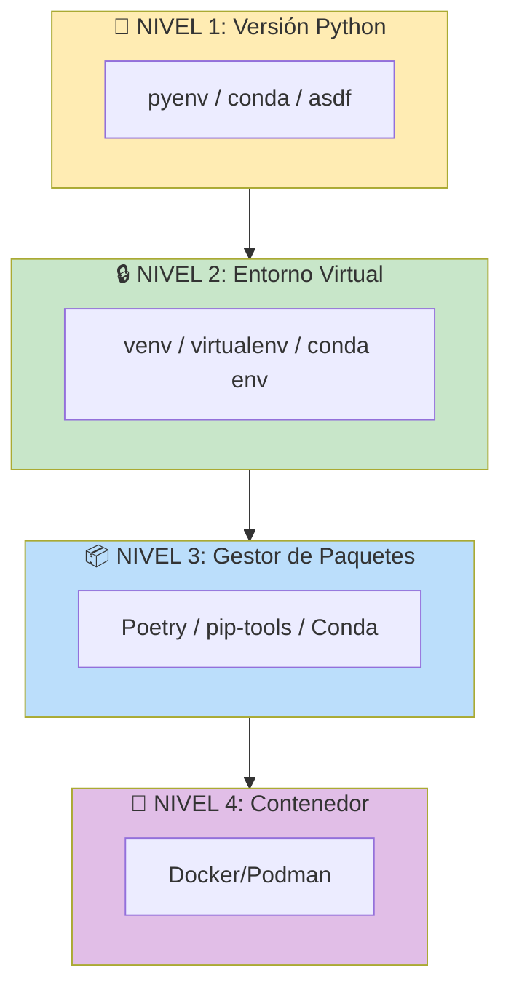

# ════════════════════════════════════════════════════════════════════════════════
# MÓDULO 04: ENTORNOS PROFESIONALES
# Virtualenv vs Conda vs Poetry vs Docker: Análisis Comparativo
# Guía MLOps v5.0: Senior Edition | DuqueOM | Noviembre 2025
# ════════════════════════════════════════════════════════════════════════════════

<div align="center">

# 🔧 MÓDULO 04: Entornos Profesionales

### El Arte de la Reproducibilidad a Nivel de Dependencias

*"'Funciona en mi máquina' es la excusa más cara de la industria."*

| Duración             | Teoría               | Práctica             |
| :------------------: | :------------------: | :------------------: |
| **4-5 horas**        | 30%                  | 70%                  |

</div>

---

<a id="00-prerrequisitos"></a>

## 0.0 Prerrequisitos

- Haber completado **[03_ESTRUCTURA_PROYECTO](03_ESTRUCTURA_PROYECTO.md)** (o al menos entender `pyproject.toml`, `Makefile` y `requirements*`).
- Poder crear/activar un entorno virtual y ejecutar comandos en terminal.
- Tener claro el objetivo: reproducibilidad entre tu máquina, CI y (eventualmente) Docker.

---

<a id="01-protocolo-e-como-estudiar-este-modulo"></a>

## 0.1 🧠 Protocolo E: Cómo estudiar este módulo

- **Antes de configurar**: abre **[Protocolo E](study_tools/PROTOCOLO_E.md)** y define tu *output mínimo* (ej: “entorno reproducible + lockfile + CI instala igual”).
- **Mientras depuras**: si te atoras >15 min (pip vs python -m pip, conflicto de versiones, lockfiles), registra el bloqueo en **[Diario de Errores](study_tools/DIARIO_ERRORES.md)**.
- **Al cerrar la semana**: usa **[Cierre Semanal](study_tools/CIERRE_SEMANAL.md)** para decidir qué mejorar (pinning, caching en CI, Docker alignment).

---

<a id="02-entregables-verificables-minimo-viable"></a>

## 0.2 ✅ Entregables verificables (mínimo viable)

Al terminar este módulo, deberías poder mostrar (en al menos 1 proyecto del portafolio):

- [ ] **Un flujo reproducible** de instalación (documentado en README o Makefile).
- [ ] **Un lockfile** que “congele” versiones (`requirements.txt`/`poetry.lock`/`environment.lock`).
- [ ] **CI instalando el mismo entorno** (sin “version drift”).
- [ ] **Validación mínima**: `python -c "import pandas; print(pandas.__version__)"` y `pytest` desde la raíz.

---

<a id="03-puente-teoria-codigo-portafolio"></a>

## 0.3 🧩 Puente teoría ↔ código (Portafolio)

Para que esto cuente como progreso real, fuerza este mapeo:

- **Concepto**: reproducibilidad / lockfiles / CI caching / alignment con Docker
- **Archivo**: `requirements.in`, `requirements.txt`, `pyproject.toml`, `poetry.lock`, `environment.yml`, `.github/workflows/*.yml`, `Dockerfile`
- **Prueba**: instalación limpia + tests (idealmente en CI) sin cambiar versiones manualmente.

---

## 📋 Contenido

- **0.0** [Prerrequisitos](#00-prerrequisitos)
- **0.1** [Protocolo E: Cómo estudiar este módulo](#01-protocolo-e-como-estudiar-este-modulo)
- **0.2** [Entregables verificables (mínimo viable)](#02-entregables-verificables-minimo-viable)
- **0.3** [Puente teoría ↔ código (Portafolio)](#03-puente-teoria-codigo-portafolio)
- [ADR de Inicio](#adr-inicio)
- [4.1 El Problema](#41-problema)
- [4.2 Comparativa](#42-comparativa)
- [4.3 venv + pip-tools](#43-pip-tools)
- [4.4 Poetry](#44-poetry)
- [4.5 Conda](#45-conda)
- [4.6 Docker Dev](#46-docker-dev)
- [4.7 Integración con CI/CD](#47-ci-cd)
- [Errores habituales](#errores-habituales)
- [4.8 Ejercicio Práctico](#48-ejercicio)
- [4.9 Autoevaluación](#49-autoevaluacion)

---

<a id="adr-inicio"></a>

## 🎯 ADR de Inicio: ¿Por Qué Importan los Entornos?

```
╔═══════════════════════════════════════════════════════════════════════════════╗
║  ADR-005: Gestión de Entornos como Práctica Obligatoria                       ║
╠═══════════════════════════════════════════════════════════════════════════════╣
║                                                                               ║
║  CONTEXTO:                                                                    ║
║  El 30% de bugs en producción ML se deben a diferencias de versiones          ║
║  entre desarrollo y producción (Google ML Engineering Best Practices).        ║
║                                                                               ║
║  DECISIÓN:                                                                    ║
║  Todo proyecto DEBE tener un sistema de gestión de dependencias con           ║
║  versiones pinneadas y un método documentado de reproducir el entorno.        ║
║                                                                               ║
║  CONSECUENCIAS:                                                               ║
║  (+) Reproducibilidad garantizada entre máquinas                              ║
║  (+) Onboarding de nuevos desarrolladores en minutos, no días                 ║
║  (+) CI/CD confiable (mismas versiones siempre)                               ║
║  (-) Setup inicial requiere más tiempo                                        ║
║                                                                               ║
╚═══════════════════════════════════════════════════════════════════════════════╝
```

### Lo Que Lograrás en Este Módulo

1. **Entender** las diferencias entre venv, Conda, Poetry y Docker
2. **Elegir** la herramienta correcta según tu proyecto
3. **Configurar** un entorno profesional con lockfiles
4. **Integrar** el entorno con CI/CD

### 🧩 Cómo se aplica en este portafolio

- En **BankChurn-Predictor**, **CarVision-Market-Intelligence** y
  **TelecomAI-Customer-Intelligence** ya encontrarás:
  - Ficheros `requirements-core.txt`, `requirements.in` y `requirements.txt` para gestionar
    dependencias de forma reproducible.
  - Un `Makefile` con targets como `install`, `test` y `serve` que asumen un entorno activo.
  - Archivos `docker-compose.demo.yml` y `docker-compose.yml` que levantan el stack completo
    (APIs, MLflow, dashboards).
- Usa este módulo para entender **por qué** esas piezas existen y cómo recrear el mismo entorno
  desde cero en tu máquina o en CI/CD.

---

<a id="41-problema"></a>

## 4.1 El Problema: "Funciona en Mi Máquina"

```
╔═══════════════════════════════════════════════════════════════════════════════╗
║                         😱 EL HORROR DE LAS DEPENDENCIAS                      ║
╠═══════════════════════════════════════════════════════════════════════════════╣
║                                                                               ║
║   ESCENARIO TÍPICO:                                                           ║
║                                                                               ║
║   Developer A (laptop):                                                       ║
║   • Python 3.11.4                                                             ║
║   • scikit-learn 1.3.0                                                        ║
║   • pandas 2.0.3                                                              ║
║   • numpy 1.24.3                                                              ║
║   → "Todo funciona perfecto" ✅                                               ║
║                                                                               ║
║   Developer B (otra laptop):                                                  ║
║   • Python 3.9.7                                                              ║
║   • scikit-learn 1.0.2                                                        ║
║   • pandas 1.4.0                                                              ║
║   • numpy 1.21.0                                                              ║
║   → "AttributeError: module 'sklearn' has no attribute 'X'" ❌                ║
║                                                                               ║
║   Servidor de producción:                                                     ║
║   • Python 3.8.10                                                             ║
║   • Versiones "whatever pip installed"                                        ║
║   → CRASH EN PRODUCCIÓN 💥                                                    ║
║                                                                               ║
╚═══════════════════════════════════════════════════════════════════════════════╝
```

### Las 4 Capas de Reproducibilidad



### 🧠 Mapa Mental de Conceptos: Entornos Reproducibles

```
                         ╔═════════════════════════════════════════╗
                         ║    ENTORNOS REPRODUCIBLES EN ML         ║
                         ╚═════════════════════════════════════════╝
                                            │
         ┌──────────────────────────────────┼──────────────────────────────────┐
         ▼                                  ▼                                  ▼
┌──────────────────┐              ┌──────────────────┐              ┌──────────────────┐
│   HERRAMIENTAS   │              │    CONCEPTOS     │              │     ARCHIVOS     │
└──────────────────┘              └──────────────────┘              └──────────────────┘
       │                                 │                                 │
├─ venv (built-in)               ├─ Lockfile                       ├─ requirements.txt
├─ pip-tools                     ├─ Pinning                        ├─ pyproject.toml
├─ Poetry                        ├─ Reproducibilidad               ├─ poetry.lock
├─ Conda                         ├─ Aislamiento                    ├─ environment.yml
└─ Docker                        └─ Version drift                  └─ Dockerfile
```

**Términos clave que debes dominar:**

| Término | Significado | Ejemplo |
|---------|-------------|---------|
| **Entorno virtual** | Aislamiento de paquetes por proyecto | `.venv/`, `conda env` |
| **Lockfile** | Archivo con versiones exactas congeladas | `requirements.txt`, `poetry.lock` |
| **Pinning** | Fijar versión exacta de una dependencia | `pandas==2.0.3` vs `pandas>=2.0` |
| **Version drift** | Versiones diferentes entre máquinas | Dev: 1.3.0, Prod: 1.0.2 |
| **pip-tools** | Herramienta para generar lockfiles | `pip-compile`, `pip-sync` |

---

### 💻 Ejercicio Puente: Crear Entorno Básico

> **Meta**: Antes de usar herramientas avanzadas, domina lo básico.

**Ejercicio 1: venv + requirements.txt**
```bash
# TU TAREA: Crea un entorno virtual y lockfile desde cero
# 1. Crear entorno
python -m venv .venv

# 2. Activar (Linux/Mac)
source .venv/bin/activate

# 3. Instalar dependencias
pip install pandas scikit-learn

# 4. Generar lockfile
pip freeze > requirements.txt

# 5. ¿Qué contiene requirements.txt?
cat requirements.txt
```

**Ejercicio 2: Reproducir en otra máquina (simulado)**
```bash
# TU TAREA: Simula "otra máquina" con entorno nuevo
deactivate
rm -rf .venv
python -m venv .venv
source .venv/bin/activate

# Instalar desde lockfile
pip install -r requirements.txt

# Verificar: ¿mismas versiones?
python -c "import pandas; print(pandas.__version__)"
```

<details>
<summary>🔍 Ver Solución</summary>

```bash
# El requirements.txt debería tener algo como:
# numpy==1.24.3
# pandas==2.0.3
# scikit-learn==1.3.0
# (más dependencias transitivas)

# La clave es que las versiones son EXACTAS (==)
# No rangos (>=), no "whatever pip decides"
```
</details>

---

### 🛠️ Práctica del Portafolio: Entorno de BankChurn

> **Tarea**: Recrear el entorno exacto de BankChurn-Predictor.

**Paso 1: Examina los archivos de dependencias**
```bash
cd BankChurn-Predictor
ls -la requirements*.txt pyproject.toml
```

**Paso 2: Crea entorno limpio**
```bash
# Destruir cualquier entorno existente
rm -rf .venv

# Crear nuevo
python -m venv .venv
source .venv/bin/activate
```

**Paso 3: Instala con el método del proyecto**
```bash
# Opción 1: Si hay Makefile
make install

# Opción 2: Si usa pyproject.toml
pip install -e ".[dev]"

# Opción 3: Si hay requirements.txt
pip install -r requirements.txt
```

**Paso 4: Verifica**
```bash
pytest  # ¿Pasan los tests?
python -c "from bankchurn import ChurnTrainer; print('✅')"
```

---

### ✅ Checkpoint de Conocimiento: Entornos

**Pregunta 1**: ¿Cuál es la diferencia entre `pandas>=2.0` y `pandas==2.0.3`?

A) No hay diferencia  
B) `>=2.0` permite cualquier versión 2.x+, `==2.0.3` fija versión exacta  
C) `==2.0.3` es más rápido  
D) `>=2.0` es para producción  

**Pregunta 2**: ¿Por qué un lockfile es importante para CI/CD?

A) Hace la instalación más rápida  
B) Garantiza que CI instale EXACTAMENTE las mismas versiones que desarrollo  
C) GitHub lo requiere  
D) Reduce el tamaño del repositorio  

**Pregunta 3**: Developer A tiene `numpy 1.24`, Developer B tiene `numpy 1.21`. ¿Qué problema pueden tener?

A) Ninguno, numpy es compatible  
B) Funciones que existen en 1.24 no existen en 1.21 (código de A falla en B)  
C) El código será más lento  
D) Git tendrá conflictos  

**🔧 Escenario de Debugging:**

```
Situación: Ejecutas tu código en CI y obtienes:
  AttributeError: module 'sklearn.preprocessing' has no attribute 'TargetEncoder'

Pero en tu máquina local funciona.

Tu requirements.txt tiene:
  scikit-learn>=1.0
```

**¿Cuál es el problema y cómo lo solucionarías?**

<details>
<summary>🔍 Ver Respuestas</summary>

**Pregunta 1**: B) `>=2.0` permite cualquier versión 2.x+. Esto causa "version drift".

**Pregunta 2**: B) Garantiza que CI instale EXACTAMENTE las mismas versiones.

**Pregunta 3**: B) Funciones que existen en 1.24 no existen en 1.21.

**Escenario de Debugging**: 
- **Problema**: `TargetEncoder` se añadió en sklearn 1.3. `>=1.0` permite instalar 1.0-1.2 donde no existe.
- **Solución**: Usar versión pinneada: `scikit-learn==1.3.0`
- **Mejor práctica**: Usar `pip-compile` para generar lockfile con versiones exactas.
</details>

---

<a id="42-comparativa"></a>

## 4.2 Comparativa de Herramientas

### Matriz de Decisión

| Criterio | venv + pip | Conda | Poetry | Docker Dev |
| :------- | :--------: | :---: | :----: | :--------: |
| **Simplicidad** | ⭐⭐⭐⭐⭐ | ⭐⭐⭐ | ⭐⭐⭐⭐ | ⭐⭐ |
| **Reproducibilidad** | ⭐⭐ | ⭐⭐⭐ | ⭐⭐⭐⭐⭐ | ⭐⭐⭐⭐⭐ |
| **Deps no-Python** | ❌ | ✅ | ❌ | ✅ |
| **Lockfile nativo** | ❌ (req pip-tools) | ❌ | ✅ | N/A |
| **Speed** | ⭐⭐⭐⭐⭐ | ⭐⭐ | ⭐⭐⭐⭐ | ⭐⭐⭐ |
| **CI/CD friendly** | ✅ | ⚠️ | ✅ | ✅ |
| **Espacio disco** | Bajo | Alto | Bajo | Medio-Alto |
| **Curva aprendizaje** | Baja | Media | Baja | Media |

### ¿Cuándo Usar Cada Uno?

```
╔═══════════════════════════════════════════════════════════════════════════════╗
║                    GUÍA DE SELECCIÓN DE HERRAMIENTA                           ║
╠═══════════════════════════════════════════════════════════════════════════════╣
║                                                                               ║
║  USA venv + pip-tools SI:                                                     ║
║  • Proyecto simple, solo dependencias Python                                  ║
║  • Equipo pequeño, ya conoce pip                                              ║
║  • CI/CD en GitHub Actions (pip es más rápido)                                ║
║  • No necesitas lockfile sofisticado                                          ║
║                                                                               ║
║  USA Conda SI:                                                                ║
║  • Necesitas librerías con dependencias C/C++ (CUDA, MKL, OpenCV)             ║
║  • Trabajas en Data Science pesado (numpy, scipy optimizados)                 ║
║  • Tu equipo ya usa Conda                                                     ║
║  • Necesitas múltiples versiones de Python fácilmente                         ║
║                                                                               ║
║  USA Poetry SI:                                                               ║
║  • Proyecto serio que necesita reproducibilidad exacta                        ║
║  • Quieres publicar en PyPI                                                   ║
║  • Valoras lockfiles y dependency resolution robusta                          ║
║  • Equipo moderno que aprecia herramientas bien diseñadas                     ║
║                                                                               ║
║  USA Docker Dev Containers SI:                                                ║
║  • Reproducibilidad TOTAL es crítica                                          ║
║  • Múltiples servicios (DB, Redis, etc.) en desarrollo                        ║
║  • Onboarding debe ser "clone & run"                                          ║
║  • Equipo usa VS Code con extensión Dev Containers                            ║
║                                                                               ║
╚═══════════════════════════════════════════════════════════════════════════════╝
```

---

<a id="43-pip-tools"></a>

## 4.3 Opción 1: venv + pip-tools (Simple y Efectivo)

### Setup Básico

```bash
# Crear entorno virtual
python3.11 -m venv .venv              # -m venv: ejecuta módulo venv. .venv: carpeta destino.
                                      # Crea una copia aislada del intérprete Python.

# Activar
source .venv/bin/activate             # Linux/Mac: modifica PATH para usar Python del venv.
# .venv\Scripts\activate              # Windows: mismo efecto, sintaxis diferente.

# Instalar pip-tools para lockfiles
pip install pip-tools                 # pip-tools: genera lockfiles con versiones exactas.
```

### Estructura de Archivos

```
project/
├── requirements.in        # Dependencias directas (lo que escribes)
├── requirements.txt       # Lockfile generado (no editar manualmente)
├── requirements-dev.in    # Dependencias de desarrollo
├── requirements-dev.txt   # Lockfile de desarrollo
└── .python-version        # Versión de Python (para pyenv)
```

### requirements.in (Lo que escribes)

```
# requirements.in - Dependencias directas
# Solo especifica las que usas directamente, pip-tools resuelve el resto

pandas>=2.0.0,<3.0.0
scikit-learn>=1.3.0
pydantic>=2.0.0
fastapi>=0.100.0
mlflow>=2.8.0
pyyaml>=6.0
```

### Generar Lockfile

```bash
# Genera requirements.txt con TODAS las versiones exactas
pip-compile requirements.in --output-file=requirements.txt  # Lee .in, resuelve deps, genera .txt con versiones exactas.

# Para desarrollo
pip-compile requirements-dev.in --output-file=requirements-dev.txt  # Misma lógica para deps de desarrollo.

# Instalar desde lockfile
pip-sync requirements.txt requirements-dev.txt  # Instala EXACTAMENTE lo del lockfile (añade y remueve).
```

### requirements.txt Generado (NO EDITAR)

```
# This file is autogenerated by pip-compile with Python 3.11
# Do not edit manually.

annotated-types==0.6.0
    # via pydantic
anyio==4.0.0
    # via
    #   httpx
    #   starlette
certifi==2023.11.17
    # via httpx
fastapi==0.104.1
    # via -r requirements.in
numpy==1.26.2
    # via
    #   pandas
    #   scikit-learn
pandas==2.1.3
    # via -r requirements.in
pydantic==2.5.2
    # via
    #   -r requirements.in
    #   fastapi
# ... etc (versiones EXACTAS)
```

### Makefile para Automatización

```makefile
# Makefile
.PHONY: venv install lock sync clean  # .PHONY: estos targets no son archivos, son comandos.

PYTHON := python3.11                  # Variable: versión de Python a usar.
VENV := .venv                         # Variable: carpeta del entorno virtual.
BIN := $(VENV)/bin                    # Variable: ruta a binarios del venv.

venv:                                 # Target: crear entorno virtual.
	$(PYTHON) -m venv $(VENV)         # Crea venv con Python especificado.
	$(BIN)/pip install --upgrade pip pip-tools  # Actualiza pip e instala pip-tools.

lock: venv                            # Target: generar lockfiles. Depende de venv.
	$(BIN)/pip-compile requirements.in -o requirements.txt  # Genera lockfile principal.
	$(BIN)/pip-compile requirements-dev.in -o requirements-dev.txt  # Genera lockfile de desarrollo.

sync: venv                            # Target: sincronizar entorno con lockfiles.
	$(BIN)/pip-sync requirements.txt requirements-dev.txt  # Instala exactamente lo del lockfile.

install: venv lock sync               # Target compuesto: ejecuta venv → lock → sync en orden.

clean:                                # Target: limpiar todo.
	rm -rf $(VENV)                    # Elimina carpeta del venv.
	rm -f requirements.txt requirements-dev.txt  # Elimina lockfiles generados.
```

---

<a id="44-poetry"></a>

## 4.4 Opción 2: Poetry (Moderno y Robusto)

### Instalación

```bash
# Instalar Poetry (método oficial)
curl -sSL https://install.python-poetry.org | python3 -  # Descarga e instala Poetry globalmente.

# Verificar
poetry --version                      # Debería mostrar algo como "Poetry 1.7.0".
```

### Inicializar Proyecto

```bash
# En proyecto existente
poetry init                           # Wizard interactivo que crea pyproject.toml.

# O crear nuevo proyecto
poetry new bankchurn-predictor        # Crea estructura de carpetas + pyproject.toml.
```

### pyproject.toml Completo

```toml
[tool.poetry]                           # Sección de metadata de Poetry.
name = "bankchurn"                      # Nombre del paquete (para pip install).
version = "0.1.0"                       # Versión semántica del proyecto.
description = "Predictor de churn bancario con MLOps"
authors = ["Tu Nombre <tu@email.com>"]
readme = "README.md"                    # Archivo README a incluir en el paquete.
packages = [{include = "bankchurn", from = "src"}]  # Dónde está el código fuente.

[tool.poetry.dependencies]              # Dependencias de producción.
python = "^3.10"                        # ^3.10: compatible con 3.10, 3.11, 3.12 pero no 4.0.
pandas = "^2.0.0"                       # ^ = "compatible con" (semver).
scikit-learn = "^1.3.0"
pydantic = "^2.0.0"
fastapi = "^0.104.0"
uvicorn = "^0.24.0"                     # Server ASGI para FastAPI.
mlflow = "^2.8.0"
pyyaml = "^6.0"
joblib = "^1.3.0"                       # Serialización de modelos sklearn.

[tool.poetry.group.dev.dependencies]    # Dependencias solo para desarrollo.
pytest = "^7.4.0"                       # Framework de testing.
pytest-cov = "^4.1.0"                   # Plugin de coverage para pytest.
mypy = "^1.6.0"                         # Type checker.
ruff = "^0.1.0"                         # Linter + formatter.
pre-commit = "^3.5.0"                   # Hooks de pre-commit.
ipython = "^8.0.0"                      # REPL mejorado.

[tool.poetry.group.docs.dependencies]   # Dependencias para documentación.
mkdocs = "^1.5.0"                       # Generador de documentación.
mkdocs-material = "^9.4.0"              # Tema popular para MkDocs.

[tool.poetry.scripts]                   # Comandos CLI que se instalan.
bankchurn-train = "bankchurn.cli:train"  # `bankchurn-train` → ejecuta cli.train().
bankchurn-predict = "bankchurn.cli:predict"

[build-system]                          # Configuración de build (PEP 517).
requires = ["poetry-core"]              # Backend de build.
build-backend = "poetry.core.masonry.api"

# ════════════════════════════════════════════════════════════════════
# CONFIGURACIÓN DE HERRAMIENTAS
# ════════════════════════════════════════════════════════════════════

[tool.ruff]
line-length = 100
select = ["E", "F", "I", "W", "B", "C4", "UP"]
ignore = ["E501"]
src = ["src"]

[tool.mypy]
python_version = "3.11"
warn_return_any = true
disallow_untyped_defs = true
ignore_missing_imports = true

[tool.pytest.ini_options]
testpaths = ["tests"]
addopts = "-v --cov=src/bankchurn --cov-report=term-missing"

[tool.coverage.run]
source = ["src"]
omit = ["tests/*"]
```

### Comandos Esenciales

```bash
# Instalar dependencias (crea poetry.lock automáticamente)
poetry install

# Añadir dependencia
poetry add pandas
poetry add --group dev pytest

# Actualizar dependencias
poetry update

# Ejecutar comando en el entorno
poetry run python src/bankchurn/main.py
poetry run pytest

# Activar shell en el entorno
poetry shell

# Exportar a requirements.txt (para Docker)
poetry export -f requirements.txt --output requirements.txt --without-hashes

# Build del paquete
poetry build
```

### poetry.lock (Generado Automáticamente)

El archivo `poetry.lock` contiene TODAS las versiones exactas de TODAS las dependencias (directas y transitivas). **SIEMPRE** commitear este archivo.

---

<a id="45-conda"></a>

## 4.5 Opción 3: Conda (Para Data Science Pesado)

### Cuándo Conda es la Mejor Opción

```
╔═══════════════════════════════════════════════════════════════════════════════╗
║                         ✅ USA CONDA SI NECESITAS:                            ║
╠═══════════════════════════════════════════════════════════════════════════════╣
║                                                                               ║
║   • CUDA / cuDNN para GPU computing                                           ║
║   • NumPy/SciPy compilados con MKL (Intel) o OpenBLAS optimizado              ║
║   • OpenCV con dependencias de sistema                                        ║
║   • R + Python en el mismo entorno                                            ║
║   • Librerías geoespaciales (GDAL, GEOS, PROJ)                                ║
║   • Dependencias de sistema que pip no puede instalar                         ║
║                                                                               ║
╚═══════════════════════════════════════════════════════════════════════════════╝
```

### environment.yml

```yaml
# environment.yml
name: bankchurn
channels:
  - conda-forge  # Preferir conda-forge sobre defaults
  - defaults

dependencies:
  # Python version
  - python=3.11
  
  # Core data science (optimizados con MKL)
  - numpy=1.26.*
  - pandas=2.1.*
  - scikit-learn=1.3.*
  
  # Si necesitas GPU
  # - pytorch
  # - cudatoolkit=11.8
  
  # Dependencias que tienen componentes C
  - pyyaml
  - joblib
  
  # pip dependencies (las que no están en conda o prefieres de PyPI)
  - pip
  - pip:
    - pydantic>=2.0.0
    - fastapi>=0.104.0
    - uvicorn>=0.24.0
    - mlflow>=2.8.0
    - pytest>=7.4.0
    - mypy>=1.6.0
    - ruff>=0.1.0
```

### Comandos Conda

```bash
# Crear entorno desde archivo
conda env create -f environment.yml

# Activar
conda activate bankchurn

# Exportar entorno exacto (para reproducibilidad)
conda env export > environment-lock.yml

# Exportar solo dependencias explícitas
conda env export --from-history > environment.yml

# Actualizar entorno
conda env update -f environment.yml --prune

# Listar entornos
conda env list

# Eliminar entorno
conda env remove -n bankchurn
```

### Mamba: Conda Acelerado

```bash
# Instalar mamba (resolver mucho más rápido)
conda install -c conda-forge mamba

# Usar mamba en lugar de conda
mamba env create -f environment.yml
mamba install numpy
```

---

<a id="46-docker-dev"></a>

## 4.6 Opción 4: Docker Dev Containers

### ¿Por Qué Docker para Desarrollo?

```
╔═══════════════════════════════════════════════════════════════════════════════╗
║                       DOCKER DEV CONTAINERS: PROS/CONS                        ║
╠═══════════════════════════════════════════════════════════════════════════════╣
║                                                                               ║
║   ✅ PROS:                                                                    ║
║   • Reproducibilidad TOTAL (mismo OS, mismas versiones de todo)               ║
║   • Onboarding = "git clone && code ." (con VS Code Dev Containers)           ║
║   • Mismo entorno en dev, CI y producción                                     ║
║   • Puedes incluir servicios (PostgreSQL, Redis, MLflow server)               ║
║                                                                               ║
║   ❌ CONS:                                                                    ║
║   • Overhead de Docker (memoria, CPU)                                         ║
║   • Más complejo de configurar inicialmente                                   ║
║   • Debugging puede ser más difícil                                           ║
║   • Performance de I/O en volúmenes (especialmente macOS)                     ║
║                                                                               ║
╚═══════════════════════════════════════════════════════════════════════════════╝
```

### .devcontainer/devcontainer.json

```json
{
    "name": "BankChurn Dev",
    "dockerComposeFile": "docker-compose.yml",
    "service": "app",
    "workspaceFolder": "/workspace",
    
    "customizations": {
        "vscode": {
            "extensions": [
                "ms-python.python",
                "ms-python.vscode-pylance",
                "charliermarsh.ruff",
                "ms-toolsai.jupyter",
                "redhat.vscode-yaml",
                "GitHub.copilot"
            ],
            "settings": {
                "python.defaultInterpreterPath": "/workspace/.venv/bin/python",
                "python.formatting.provider": "none",
                "editor.formatOnSave": true,
                "[python]": {
                    "editor.defaultFormatter": "charliermarsh.ruff"
                }
            }
        }
    },
    
    "postCreateCommand": "make install",
    
    "forwardPorts": [8000, 5000, 3000],
    
    "remoteUser": "vscode"
}
```

### .devcontainer/docker-compose.yml

```yaml
version: '3.8'

services:
  app:
    build:
      context: ..
      dockerfile: .devcontainer/Dockerfile
    volumes:
      - ..:/workspace:cached
      - venv:/workspace/.venv
    environment:
      - PYTHONDONTWRITEBYTECODE=1
      - PYTHONUNBUFFERED=1
    command: sleep infinity
    
  mlflow:
    image: ghcr.io/mlflow/mlflow:v2.8.0
    ports:
      - "5000:5000"
    volumes:
      - mlflow-data:/mlflow
    command: mlflow server --host 0.0.0.0 --backend-store-uri sqlite:///mlflow/mlflow.db --default-artifact-root /mlflow/artifacts
    
  postgres:
    image: postgres:15
    environment:
      POSTGRES_USER: bankchurn
      POSTGRES_PASSWORD: bankchurn
      POSTGRES_DB: bankchurn
    volumes:
      - postgres-data:/var/lib/postgresql/data
    ports:
      - "5432:5432"

volumes:
  venv:
  mlflow-data:
  postgres-data:
```

### .devcontainer/Dockerfile

```dockerfile
FROM python:3.11-slim

# Dependencias del sistema
RUN apt-get update && apt-get install -y --no-install-recommends \
    git \
    curl \
    make \
    && rm -rf /var/lib/apt/lists/*

# Usuario no-root
ARG USERNAME=vscode
ARG USER_UID=1000
ARG USER_GID=$USER_UID

RUN groupadd --gid $USER_GID $USERNAME \
    && useradd --uid $USER_UID --gid $USER_GID -m $USERNAME

# Workspace
WORKDIR /workspace

# Cambiar a usuario no-root
USER $USERNAME

# Pre-instalar pip-tools
RUN pip install --user pip-tools

ENV PATH="/home/${USERNAME}/.local/bin:${PATH}"
```

---

<a id="47-ci-cd"></a>

## 4.7 Integración con CI/CD

### GitHub Actions con pip

```yaml
# .github/workflows/ci.yml
name: CI

on: [push, pull_request]

jobs:
  test:
    runs-on: ubuntu-latest
    
    steps:
      - uses: actions/checkout@v4
      
      - name: Set up Python
        uses: actions/setup-python@v5
        with:
          python-version: '3.11'
          cache: 'pip'  # Cachea dependencias
      
      - name: Install dependencies
        run: |
          pip install -r requirements.txt
          pip install -r requirements-dev.txt
      
      - name: Run tests
        run: pytest tests/ -v --cov
```

### GitHub Actions con Poetry

```yaml
name: CI

on: [push, pull_request]

jobs:
  test:
    runs-on: ubuntu-latest
    
    steps:
      - uses: actions/checkout@v4
      
      - name: Set up Python
        uses: actions/setup-python@v5
        with:
          python-version: '3.11'
      
      - name: Install Poetry
        uses: snok/install-poetry@v1
        with:
          version: 1.7.0
          virtualenvs-create: true
          virtualenvs-in-project: true
      
      - name: Load cached venv
        uses: actions/cache@v3
        with:
          path: .venv
          key: venv-${{ runner.os }}-${{ hashFiles('poetry.lock') }}
      
      - name: Install dependencies
        run: poetry install --no-interaction
      
      - name: Run tests
        run: poetry run pytest tests/ -v --cov
```

---

<a id="errores-habituales"></a>

## 🧨 Errores habituales y cómo depurarlos en entornos

Los problemas de este módulo se manifiestan como **inconsistencias entre máquinas**: algo funciona en tu laptop pero no en el servidor, o en CI. Aquí van los patrones más frecuentes y cómo atacarlos.

Si alguno de estos errores te tomó **>15 minutos**, regístralo en el **[Diario de Errores](study_tools/DIARIO_ERRORES.md)** y aplica el flujo de **rescate cognitivo** de **[Protocolo E](study_tools/PROTOCOLO_E.md)**.

### 1) Entorno virtual mal activado (`pip` instala en el sitio equivocado)

**Síntomas típicos**

- Ejecutas `pip install` y luego `python -c "import pandas"` y obtienes `ModuleNotFoundError`.
- Tienes varias versiones de Python (`python`, `python3`, `pyenv`, Conda) y no sabes cuál está usando tu proyecto.
- En CI funciona con una versión de paquete y en local con otra.

**Cómo identificarlo**

- Ejecuta:
  ```bash
  which python
  python -m pip --version
  ```
  y verifica que ambos apuntan al **mismo entorno** (`.venv/bin/python`, por ejemplo).
- En Windows, revisa la ruta de `Scripts` y que estés en el entorno correcto (`(.venv)` en el prompt).

**Cómo corregirlo**

- Usa siempre `python -m pip` en lugar de `pip` a secas:
  ```bash
  python -m pip install -r requirements.txt
  ```
- Documenta en el README/Makefile **cómo activar el entorno** (`source .venv/bin/activate`, `poetry shell`, `conda activate ...`).
- Si usas `.python-version` con `pyenv`, asegúrate de que coincide con la versión definida en `pyproject.toml` o `environment.yml`.

---

### 2) Lockfiles ignorados (`requirements.txt` / `poetry.lock` / `environment-lock.yml`)

**Síntomas típicos**

- Dos personas hacen `pip install -r requirements.txt` y obtienen versiones distintas de las mismas librerías.
- En tu máquina funciona con `pandas==2.0.3` pero en producción falla con `pandas==2.2.0`.
- `poetry.lock` o `requirements-dev.txt` no están commiteados.

**Cómo identificarlo**

- Revisa el repositorio:
  - ¿Existe `requirements.txt` generado por pip-tools y está en Git?
  - ¿Existe `poetry.lock` y está versionado?
  - ¿Hay algún `environment-lock.yml` de Conda?
- Compara lo que dice el lockfile con lo que tienes instalado:
  ```bash
  pip freeze | grep pandas
  ```

**Cómo corregirlo**

- **Siempre** commitea el lockfile (requirements.txt, poetry.lock, environment-lock.yml).
- Define una única fuente de verdad: si usas pip-tools, no edites `requirements.txt` a mano, solo `requirements.in`.
- En CI, instala **desde el lockfile**, no desde las dependencias sueltas.

---

### 3) Mezclar gestores (pip + Conda + Poetry + Docker) sin una estrategia clara

**Síntomas típicos**

- Instalas algo con `conda install` y luego con `pip install` y el entorno se rompe.
- Tienes `environment.yml`, `requirements.txt` y `pyproject.toml` en el mismo proyecto sin que ninguno esté claro.
- El contenedor Docker instala versiones diferentes a las de tu entorno local.

**Cómo identificarlo**

- Lista tus archivos de configuración: ¿hay más de un gestor activo a la vez?
- Revisa el `Dockerfile`: ¿instala desde `requirements.txt`, desde `pyproject.toml` exportado o desde `environment.yml`?

**Cómo corregirlo**

- Elige un **flujo principal** por proyecto:
  - pip-tools → `requirements.in` → `requirements.txt` → Docker/CI.
  - Poetry → `pyproject.toml` + `poetry.lock` → export a `requirements.txt` solo para Docker.
  - Conda → `environment.yml`/`environment-lock.yml` → `conda env create` en todas partes.
- Documenta en este módulo (y en el README del proyecto) **qué gestor es el canónico** y qué archivos deben editarse.

---

### 4) CI instala un entorno distinto al local

**Síntomas típicos**

- En local todo pasa, pero en GitHub Actions los tests fallan por versiones de librerías.
- Ves que en CI se instala directamente con `pip install -r requirements.txt` pero en local usas Poetry o Conda.

**Cómo identificarlo**

- Abre el workflow (`.github/workflows/*.yml`) y verifica:
  - ¿Está usando la misma versión de Python que tú?
  - ¿Instala dependencias desde los mismos archivos (`requirements.txt`, `poetry.lock`, `environment.yml`)?

**Cómo corregirlo**

- Alinea CI con tu flujo local:
  - pip-tools: usa el snippet de "GitHub Actions con pip" de este módulo.
  - Poetry: usa el bloque de "GitHub Actions con Poetry" y cachea `.venv`.
  - Conda: usa `conda env create -f environment.yml` o `mamba`.
- Haz al menos una vez la prueba de **clonar en limpio** y seguir los pasos de CI en tu máquina; esto detecta diferencias.

---

### 5) Docker que no refleja el entorno real

**Síntomas típicos**

- La aplicación en Docker falla con `ImportError` o con versiones diferentes de librerías.
- Tu `Dockerfile` instala con `pip install pandas scikit-learn ...` en lugar de usar el lockfile.

**Cómo identificarlo**

- Revisa el `Dockerfile` (y `.devcontainer/Dockerfile` si aplica):
  - ¿Copia `requirements.txt` o usa `poetry export` antes de instalar?
  - ¿Especifica la misma versión de Python que usas localmente?

**Cómo corregirlo**

- Haz que Docker **derive** de tu configuración de entorno:
  - Con pip-tools: `COPY requirements.txt` → `pip install -r requirements.txt`.
  - Con Poetry: `poetry export -f requirements.txt --output requirements.txt` y usa eso en la imagen.
- Mantén la versión de Python del contenedor alineada con tu `.python-version` / `pyproject.toml` / `environment.yml`.

---

### Patrón general de debugging de entornos

1. **Congela la versión de Python**: pyenv, Conda o imagen base de Docker clara.
2. **Define un único gestor principal** (pip-tools, Poetry o Conda) y sigue su flujo.
3. **Asegúrate de que CI y Docker consumen el mismo lockfile**.
4. **Verifica el entorno activado** antes de instalar o ejecutar (`which python`, `python -m pip`).

Con este patrón, "funciona en mi máquina" se convierte en "funciona en cualquier máquina que siga estos pasos".

---

<a id="48-ejercicio"></a>

## 4.8 Ejercicio Práctico: Configura Tu Entorno

### Opción A: pip-tools (Recomendado para empezar)

```bash
# 1. Crear estructura
mkdir -p bankchurn-predictor && cd bankchurn-predictor

# 2. Crear archivos
cat > requirements.in << 'EOF'
pandas>=2.0.0
scikit-learn>=1.3.0
pydantic>=2.0.0
fastapi>=0.104.0
uvicorn>=0.24.0
mlflow>=2.8.0
pyyaml>=6.0
joblib>=1.3.0
EOF

cat > requirements-dev.in << 'EOF'
-r requirements.in
pytest>=7.4.0
pytest-cov>=4.1.0
mypy>=1.6.0
ruff>=0.1.0
pre-commit>=3.5.0
EOF

# 3. Crear entorno y lockfiles
python3.11 -m venv .venv
source .venv/bin/activate
pip install pip-tools
pip-compile requirements.in
pip-compile requirements-dev.in
pip-sync requirements.txt requirements-dev.txt

# 4. Verificar
python -c "import pandas; print(pandas.__version__)"
```

### Opción B: Poetry

```bash
# 1. Crear proyecto
poetry new bankchurn-predictor --src
cd bankchurn-predictor

# 2. Añadir dependencias
poetry add pandas scikit-learn pydantic fastapi uvicorn mlflow pyyaml joblib
poetry add --group dev pytest pytest-cov mypy ruff pre-commit

# 3. Instalar
poetry install

# 4. Verificar
poetry run python -c "import pandas; print(pandas.__version__)"
```

### Checklist de Verificación

```
[ ] Entorno virtual creado y activable
[ ] Lockfile generado con versiones exactas
[ ] Lockfile commiteado en Git
[ ] Puedo recrear el entorno desde cero
[ ] CI puede instalar las mismas versiones
```

---

<a id="49-autoevaluacion"></a>

## 4.9 Autoevaluación

### Checklist de Competencias

```
CONCEPTOS:
[ ] Entiendo la diferencia entre dependencias directas y transitivas
[ ] Sé qué es un lockfile y por qué es importante
[ ] Puedo explicar cuándo usar Conda vs pip vs Poetry

pip-tools:
[ ] Puedo crear requirements.in con restricciones de versión
[ ] Sé usar pip-compile y pip-sync
[ ] Entiendo el formato del lockfile generado

Poetry:
[ ] Puedo crear un pyproject.toml funcional
[ ] Sé añadir dependencias y grupos de dependencias
[ ] Puedo exportar a requirements.txt para Docker

CI/CD:
[ ] Puedo configurar caching de dependencias en GitHub Actions
[ ] Sé cómo asegurar reproducibilidad en CI
```

### Preguntas de Reflexión

1. ¿Por qué no basta con `pip install pandas` sin especificar versión?
2. ¿Cuál es la diferencia entre `requirements.in` y `requirements.txt`?
3. ¿Cuándo preferirías Conda sobre Poetry?
4. ¿Por qué es importante cachear dependencias en CI?

---

## 📦 Cómo se Usó en el Portafolio

Cada proyecto del portafolio implementa la gestión de entornos descrita:

### pyproject.toml Real

```toml
# BankChurn-Predictor/pyproject.toml (extracto)
[project]
name = "bankchurn"
version = "0.1.0"
requires-python = ">=3.10"
dependencies = [
    "pandas>=2.0.0",
    "scikit-learn>=1.3.0",
    "pydantic>=2.5.0",
    "mlflow>=2.9.0",
]

[project.optional-dependencies]
dev = [
    "pytest>=7.4.0",
    "pytest-cov>=4.1.0",
    "ruff>=0.1.9",
]
```

### Comandos Make del Portafolio

Todos los proyectos tienen Makefile con comandos consistentes:

```makefile
# Comandos disponibles en los 3 proyectos
make install     # pip install -e ".[dev]"
make test        # pytest con coverage
make lint        # ruff check
make train       # Entrena el modelo
make serve       # Inicia API FastAPI
```

### Estructura de Dependencias

| Proyecto | Archivo | Dependencias Core |
|----------|---------|-------------------|
| BankChurn | `pyproject.toml` | pandas, sklearn, pydantic, mlflow |
| CarVision | `pyproject.toml` | pandas, sklearn, pydantic, pyyaml |
| TelecomAI | `pyproject.toml` | pandas, sklearn, pydantic |

### 🔧 Ejercicio: Instala un Proyecto Real

```bash
# 1. Ve a BankChurn
cd BankChurn-Predictor

# 2. Crea entorno virtual
python -m venv .venv
source .venv/bin/activate  # Linux/Mac
# .venv\Scripts\activate   # Windows

# 3. Instala con dependencias de desarrollo
pip install -e ".[dev]"

# 4. Verifica que funciona
python -c "from bankchurn.config import BankChurnConfig; print('OK')"
make test
```

---

## 💼 Consejos Profesionales

> **Recomendaciones para destacar en entrevistas y proyectos reales**

### Para Entrevistas

1. **"¿Cómo manejas dependencias?"**: Explica pip-tools, Poetry, o uv. Menciona lock files y reproducibilidad.

2. **Containers vs Virtualenvs**: Conoce cuándo usar cada uno (dev local vs producción).

3. **DevContainers**: Menciona que usas VS Code DevContainers para entornos reproducibles.

### Para Proyectos Reales

| Situación | Consejo |
|-----------|---------|
| Conflictos de dependencias | Usa pip-compile para resolver y fijar versiones |
| CI/CD | Usa la misma imagen Docker en local y CI |
| Múltiples versiones de Python | pyenv + tox para testing multi-versión |
| Dependencias de sistema | Documenta en Dockerfile o README |

### Herramientas Modernas

- **uv**: Reemplazo rápido de pip (10-100x más rápido)
- **pip-tools**: pip-compile + pip-sync para reproducibilidad
- **Poetry**: Gestión completa de dependencias y publicación
- **Conda**: Para dependencias científicas complejas (CUDA, etc.)


---

## 📺 Recursos Externos del Módulo

> 🏷️ Sistema: 🔴 Obligatorio | 🟡 Recomendado | 🟢 Complementario

### 🎬 Videos

| 🏷️ | Título | Canal | Duración | Link |
|:--:|:-------|:------|:--------:|:-----|
| 🔴 | **Python Virtual Environments** | Corey Schafer | 16 min | [YouTube](https://www.youtube.com/watch?v=Kg1Yvry_Ydk) |
| 🔴 | **pip-tools for Dependency Management** | ArjanCodes | 15 min | [YouTube](https://www.youtube.com/watch?v=LAig6s9Hkj0) |
| 🟡 | **uv: The Fast Python Package Manager** | ArjanCodes | 12 min | [YouTube](https://www.youtube.com/watch?v=_FdjW47Au30) |
| 🟢 | **DevContainers in VS Code** | VS Code | 10 min | [YouTube](https://www.youtube.com/watch?v=b1RavPr_878) |

### 📄 Documentación

| 🏷️ | Recurso | Descripción |
|:--:|:--------|:------------|
| 🔴 | [venv Documentation](https://docs.python.org/3/library/venv.html) | Guía oficial venv |
| 🟡 | [pip-tools Docs](https://pip-tools.readthedocs.io/) | Documentación pip-tools |
| 🟢 | [uv Docs](https://github.com/astral-sh/uv) | Reemplazo rápido de pip |

---

## ⚖️ Decisión Técnica: ADR-012 Gestión de Dependencias

**Contexto**: Necesitamos dependencias reproducibles y fáciles de mantener.

**Decisión**: Usar pip-tools (pip-compile + pip-sync) con pyproject.toml.

**Alternativas Consideradas**:
- **Poetry**: Más completo pero más complejo
- **Conda**: Mejor para deps científicas (CUDA), peor para apps
- **pip directo**: Sin lock file, no reproducible

**Consecuencias**:
- ✅ Lock files para reproducibilidad exacta
- ✅ Compatible con pyproject.toml estándar
- ✅ Sin overhead de herramientas pesadas
- ❌ Requiere pip-compile manual cuando actualizas

---

## 🔧 Ejercicios del Módulo

### Ejercicio 4.1: Entorno Virtual Completo
**Objetivo**: Crear y configurar entorno virtual.
**Dificultad**: ⭐

```bash
# TU TAREA: Crear entorno, instalar proyecto en modo editable
cd mi-proyecto
# ???
```

<details>
<summary>💡 Ver solución</summary>

```bash
# 1. Crear entorno virtual
python -m venv .venv

# 2. Activar (Linux/Mac)
source .venv/bin/activate
# Windows: .venv\Scripts\activate

# 3. Actualizar pip
pip install --upgrade pip

# 4. Instalar proyecto en modo editable con deps dev
pip install -e ".[dev]"

# 5. Verificar instalación
python -c "import mymlproject; print('OK')"
pip list | grep mymlproject

# 6. Desactivar cuando termines
deactivate
```
</details>

---

### Ejercicio 4.2: pip-tools Workflow
**Objetivo**: Usar pip-compile para lock files.
**Dificultad**: ⭐⭐

```bash
# TU TAREA: Generar requirements.txt desde pyproject.toml
pip install pip-tools
# ??? generar lock file
# ??? sincronizar entorno
```

<details>
<summary>💡 Ver solución</summary>

```bash
# Instalar pip-tools
pip install pip-tools

# Generar requirements.txt desde pyproject.toml
pip-compile pyproject.toml -o requirements.txt

# Generar requirements-dev.txt con extras
pip-compile pyproject.toml --extra dev -o requirements-dev.txt

# Sincronizar entorno (instala exactamente lo del lock)
pip-sync requirements.txt requirements-dev.txt

# Actualizar una dependencia específica
pip-compile --upgrade-package pandas pyproject.toml -o requirements.txt

# Makefile target recomendado:
# requirements.txt: pyproject.toml
#     pip-compile pyproject.toml -o requirements.txt
# 
# sync: requirements.txt
#     pip-sync requirements.txt requirements-dev.txt
```
</details>

---

## 🔗 Glosario del Módulo

| Término | Definición |
|---------|------------|
| **venv** | Módulo estándar para crear entornos virtuales aislados |
| **pip-tools** | pip-compile (generar locks) + pip-sync (sincronizar entorno) |
| **lock file** | Archivo con versiones exactas de todas las dependencias |
| **editable install** | `pip install -e .` permite editar código sin reinstalar |

---

<div align="center">

**Siguiente módulo** → [05. Git Profesional](05_GIT_PROFESIONAL.md)

---

[← Volver al Índice](00_INDICE.md)

</div>
