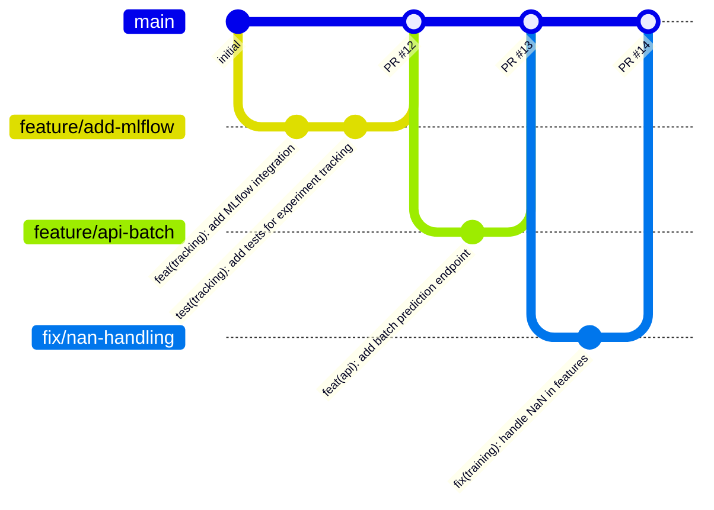

# MÓDULO 05: GIT PROFESIONAL

<div align="center">

# 🌿 MÓDULO 05: Git Profesional

### Control de Versiones que Impresiona en Code Review

*"Un historial de Git limpio es la documentación que nunca miente."*

| Duración             | Teoría               | Práctica             |
| :------------------: | :------------------: | :------------------: |
| **4-5 horas**        | 25%                  | 75%                  |

</div>

---

## 📋 Índice

- **0.0** [Prerrequisitos](#00-prerrequisitos)
- **0.1** [Protocolo E: Cómo estudiar este módulo](#01-protocolo-e-como-estudiar-este-modulo)
- **0.2** [Entregables verificables (mínimo viable)](#02-entregables-verificables-minimo-viable)
- **0.3** [Puente teoría ↔ código (Portafolio)](#03-puente-teoria-codigo-portafolio)
- [Lo que lograrás en este módulo](#lograras)
- [5.1 Conventional Commits](#51-conventional-commits)
- [5.2 Pre-commit Hooks](#52-pre-commit-hooks)
- [5.3 Estrategias de Branching](#53-branching)
- [5.4 Comandos Avanzados](#54-comandos-avanzados)
- [5.5 .gitignore profesional](#55-gitignore)
- [5.6 🔬 Ingeniería Inversa: Git Profesional](#56-ingenieria-inversa-git) ⭐ NUEVO
- [5.7 Ejercicio integrador](#57-ejercicio)
- [Errores habituales](#errores-habituales)
- [5.7 Autoevaluación](#57-autoevaluación)

---

<a id="00-prerrequisitos"></a>

## 0.0 Prerrequisitos

- Haber completado **[04_ENTORNOS](04_ENTORNOS.md)** (o al menos tener un entorno reproducible para correr hooks y CI).
- Poder ejecutar comandos básicos de terminal.
- Tener un repo Git inicializado o clonar el portafolio.

---

<a id="01-protocolo-e-como-estudiar-este-modulo"></a>

## 0.1 🧠 Protocolo E: Cómo estudiar este módulo

- **Antes de tocar ramas**: abre **[Protocolo E](study_tools/PROTOCOLO_E.md)** y define tu *output mínimo* (ej: “pre-commit + conv commits + PR limpio”).
- **Mientras haces PRs**: si te atoras >15 min (rebase, conflictos, hooks, commitlint), registra el bloqueo en **[Diario de Errores](study_tools/DIARIO_ERRORES.md)**.
- **Al cerrar la semana**: usa **[Cierre Semanal](study_tools/CIERRE_SEMANAL.md)** para mejorar tu DX (menos fricción, más calidad automática).

---

<a id="02-entregables-verificables-minimo-viable"></a>

## 0.2 ✅ Entregables verificables (mínimo viable)

Al terminar este módulo, deberías poder mostrar (en al menos 1 proyecto del portafolio):

- [ ] **Commits con Conventional Commits** consistentes (sin “wip”, “fix”, “final_final”).
- [ ] **Pre-commit instalado** y pasando en `pre-commit run --all-files`.
- [ ] **Flujo de ramas**: feature branch → PR → merge a `main` (sin commits directos a `main`).
- [ ] **Capacidad de recuperación**: poder deshacer un error usando `reflog` o `reset --soft`.

---

<a id="03-puente-teoria-codigo-portafolio"></a>

## 0.3 🧩 Puente teoría ↔ código (Portafolio)

Para que esto cuente como progreso real, fuerza este mapeo:

- **Concepto**: historial legible / prevención de errores / colaboración
- **Archivo**: `.pre-commit-config.yaml`, `.gitleaks.toml`, `.github/workflows/*`, `README.md`
- **Evidencia**: un PR con commits limpios, hooks pasando, y revisión enfocada.

---

<a id="lograras"></a>

## 🎯 Lo Que Lograrás en Este Módulo

1. **Escribir** commits que cuentan una historia clara
2. **Configurar** pre-commit hooks que previenen errores
3. **Aplicar** estrategias de branching profesionales
4. **Dominar** comandos avanzados (rebase, cherry-pick, bisect)

### 🧩 Cómo se aplica en este portafolio

- El repositorio `ML-MLOps-Portfolio` y los tres proyectos
  (`BankChurn-Predictor`, `CarVision-Market-Intelligence`, `TelecomAI-Customer-Intelligence`)
  ya usan:
  - Historial basado en **Conventional Commits**.
  - Hooks de **pre-commit** configurados en `.pre-commit-config.yaml`.
  - Escaneo de seguridad con **Gitleaks** vía `.gitleaks.toml` y workflows de CI.
- Usa este módulo como guía para entender y ajustar esos flujos en tu propio fork del portafolio
  y para mantener un historial que soporte entrevistas técnicas Senior/Staff.

---

<a id="51-conventional-commits"></a>

## 5.1 Conventional Commits: El Estándar de Industria

### ¿Por Qué Importa el Formato del Commit?

```
╔═══════════════════════════════════════════════════════════════════════════════╗
║                    ❌ HISTORIAL TÍPICO (CAÓTICO)                              ║
╠═══════════════════════════════════════════════════════════════════════════════╣
║                                                                               ║
║   * fix                                                                       ║
║   * wip                                                                       ║
║   * más cambios                                                               ║
║   * asdfgh                                                                    ║
║   * funcionaaaa                                                               ║
║   * ahora sí                                                                  ║
║   * merge conflict resuelto                                                   ║
║   * updates                                                                   ║
║                                                                               ║
║   PROBLEMAS:                                                                  ║
║   • Imposible saber qué cambió sin leer el código                             ║
║   • No puedes generar changelog automático                                    ║
║   • git bisect es inútil                                                      ║
║   • Code review es un infierno                                                ║
║                                                                               ║
╠═══════════════════════════════════════════════════════════════════════════════╣
║                    ✅ HISTORIAL PROFESIONAL (CONVENTIONAL)                    ║
╠═══════════════════════════════════════════════════════════════════════════════╣
║                                                                               ║
║   * feat(api): add /predict endpoint with batch support                       ║
║   * fix(training): handle NaN values in CreditScore column                    ║
║   * test(pipeline): add integration tests for full pipeline                   ║
║   * docs(readme): update installation instructions                            ║
║   * refactor(config): migrate from dict to Pydantic models                    ║
║   * ci(actions): add caching for pip dependencies                             ║
║   * perf(inference): reduce latency from 150ms to 45ms                        ║
║                                                                               ║
║   BENEFICIOS:                                                                 ║
║   • Changelog generado automáticamente                                        ║
║   • Semantic versioning automático                                            ║
║   • git bisect encuentra bugs rápidamente                                     ║
║   • Code review enfocado                                                      ║
║                                                                               ║
╚═══════════════════════════════════════════════════════════════════════════════╝
```

### Anatomía de un Conventional Commit

```
<type>(<scope>): <description>

[optional body]

[optional footer(s)]
```

### Tipos Permitidos

| Tipo | Cuándo Usar | Ejemplo |
| :--- | :---------- | :------ |
| `feat` | Nueva funcionalidad | `feat(api): add batch prediction endpoint` |
| `fix` | Corrección de bug | `fix(training): handle missing values in Age` |
| `docs` | Solo documentación | `docs(readme): add API usage examples` |
| `style` | Formato (no afecta lógica) | `style: apply ruff formatting` |
| `refactor` | Refactor sin cambio funcional | `refactor(config): use Pydantic BaseSettings` |
| `test` | Añadir o corregir tests | `test(inference): add unit tests for predictor` |
| `perf` | Mejora de performance | `perf(pipeline): cache preprocessor transformations` |
| `ci` | Cambios en CI/CD | `ci(actions): add Python 3.12 to test matrix` |
| `build` | Cambios en build/deps | `build(deps): upgrade scikit-learn to 1.4.0` |
| `chore` | Mantenimiento general | `chore: update .gitignore` |

### Scopes Comunes en MLOps

```
# Por componente
feat(training): ...
feat(inference): ...
feat(api): ...
feat(config): ...
feat(data): ...

# Por capa
feat(model): ...
feat(features): ...
feat(pipeline): ...

# Por herramienta
ci(actions): ...
ci(docker): ...
ci(dvc): ...
```

### 🧠 Mapa Mental de Conceptos: Git Profesional

```
                          ╔══════════════════════════════════════╗
                          ║      GIT PROFESIONAL PARA ML         ║
                          ╚══════════════════════════════════════╝
                                            │
         ┌──────────────────────────────────┼──────────────────────────────────┐
         ▼                                  ▼                                  ▼
┌──────────────────┐              ┌──────────────────┐              ┌──────────────────┐
│  COMMITS         │              │  HOOKS           │              │  BRANCHING       │
└──────────────────┘              └──────────────────┘              └──────────────────┘
       │                                 │                                 │
├─ Conventional                   ├─ pre-commit                    ├─ main (protegida)
├─ Atómicos                       ├─ ruff/black                    ├─ feature/*
├─ Descriptivos                   ├─ mypy                          ├─ fix/*
└─ Scope                          └─ gitleaks                      └─ PR + Review
```

**Términos clave que debes dominar:**

| Término | Significado | Ejemplo |
|---------|-------------|---------|
| **Conventional Commit** | Formato estándar de commits | `feat(api): add endpoint` |
| **Scope** | Componente afectado | `training`, `api`, `config` |
| **Pre-commit** | Hooks que corren antes del commit | Lint, format, type check |
| **Feature branch** | Rama para nueva funcionalidad | `feature/add-batch-prediction` |
| **Squash** | Combinar commits en uno | Antes de merge a main |

---

### 💻 Ejercicio Puente: Escribir Commits Profesionales

> **Meta**: Antes de trabajar en proyectos grandes, practica escribir commits correctos.

**Ejercicio 1: Convertir commits malos a buenos**
```
MALO: "fix"
BUENO: ???

MALO: "wip"  
BUENO: ???

MALO: "updates"
BUENO: ???
```

**Ejercicio 2: Escribir commits para estos cambios**
```
1. Añadiste un endpoint /health a la API
   → ???

2. Corregiste un bug donde el modelo fallaba con NaN en Age
   → ???

3. Añadiste tests para el módulo de predicción
   → ???

4. Mejoraste la latencia de inferencia de 200ms a 50ms
   → ???
```

<details>
<summary>🔍 Ver Soluciones</summary>

**Ejercicio 1:**
```
"fix" → "fix(training): handle edge case when dataset is empty"
"wip" → "feat(api): add initial structure for batch endpoint" (o no hacer commit aún)
"updates" → "docs(readme): update installation instructions for Python 3.11"
```

**Ejercicio 2:**
```
1. feat(api): add /health endpoint for liveness checks
2. fix(training): handle NaN values in Age column
3. test(prediction): add unit tests for ChurnPredictor class
4. perf(inference): reduce latency from 200ms to 50ms with caching
```
</details>

---

### 🛠️ Práctica del Portafolio: Commits en BankChurn

> **Tarea**: Revisar y mejorar el historial de commits de BankChurn.

**Paso 1: Examina el historial actual**
```bash
cd BankChurn-Predictor
git log --oneline -20
```

**Paso 2: Identifica patrones**
```
[ ] ¿Los commits siguen Conventional Commits?
[ ] ¿Hay commits tipo "fix" o "wip" sin contexto?
[ ] ¿Los scopes son consistentes?
```

**Paso 3: Practica con un cambio real**
```bash
# Haz un cambio pequeño (ej: mejorar un docstring)
git checkout -b fix/improve-docstring
# ... edita un archivo ...
git add .
git commit -m "docs(training): improve docstring for ChurnTrainer.fit()"
```

**Paso 4: Crea un PR (simulado o real)**
```bash
git push origin fix/improve-docstring
# Crear PR en GitHub con descripción clara
```

---

### ✅ Checkpoint de Conocimiento: Git Profesional

**Pregunta 1**: ¿Cuál es el formato correcto de Conventional Commit?

A) `Added new feature for API`  
B) `feat(api): add batch prediction endpoint`  
C) `FEAT: API batch prediction`  
D) `[feat] api - add batch prediction`  

**Pregunta 2**: ¿Por qué es importante el scope (ej: `api`, `training`)?

A) GitHub lo requiere  
B) Facilita filtrar commits por componente y entender qué afecta cada cambio  
C) Hace los commits más largos  
D) Es obligatorio para CI  

**Pregunta 3**: ¿Cuál commit es MEJOR para un code review?

A) `fix`  
B) `arreglé el bug de los datos`  
C) `fix(data): handle missing values in Balance column by using median imputation`  
D) `fix bug`  

**🔧 Escenario de Debugging:**

```
Situación: Tu código funcionaba hace 3 días pero hoy falla.
El historial de Git tiene 50 commits en esos 3 días, todos dicen:
  - "updates"
  - "fix"
  - "wip"
  - "changes"

¿Cómo encontrarías el commit que introdujo el bug?
```

<details>
<summary>🔍 Ver Respuestas</summary>

**Pregunta 1**: B) `feat(api): add batch prediction endpoint`

**Pregunta 2**: B) Facilita filtrar commits por componente y entender qué afecta cada cambio.

**Pregunta 3**: C) El commit con descripción completa permite entender el cambio sin leer código.

**Escenario de Debugging**: 
- Con commits malos: Tendrías que revisar CADA commit manualmente. Pesadilla.
- **Solución**: Usar `git bisect` para encontrar el commit, pero con mensajes malos no sabrás QUÉ cambió.
- **Lección**: Conventional Commits hacen que `git bisect` sea útil y que encuentres bugs en minutos, no horas.
</details>

<a id="52-pre-commit-hooks"></a>

## 5.2 Pre-commit Hooks: Prevenir Errores Antes del Commit

### ¿Qué Son los Pre-commit Hooks?

```
╔═══════════════════════════════════════════════════════════════════════════════╗
║                         PRE-COMMIT: EL GUARDIÁN                               ║
╠═══════════════════════════════════════════════════════════════════════════════╣
║                                                                               ║
║                        git commit -m "feat: ..."                              ║
║                                    │                                          ║
║                                    ▼                                          ║
║                    ┌───────────────────────────────┐                          ║
║                    │      PRE-COMMIT HOOKS         │                          ║
║                    │                               │                          ║
║                    │  ✓ Formatear código (ruff)    │                          ║
║                    │  ✓ Lint (ruff check)          │                          ║
║                    │  ✓ Type check (mypy)          │                          ║
║                    │  ✓ Tests rápidos              │                          ║
║                    │  ✓ Validar YAML/JSON          │                          ║
║                    │  ✓ Detectar secretos          │                          ║
║                    │  ✓ Validar commit message     │                          ║
║                    │                               │                          ║
║                    └───────────────────────────────┘                          ║
║                                   │                                           ║
║                         ┌─────────┴─────────┐                                 ║
║                         ▼                   ▼                                 ║
║                    ALL PASS ✅          ANY FAIL ❌                          ║
║                    Commit OK            Commit BLOCKED                        ║
║                                                                               ║
╚═══════════════════════════════════════════════════════════════════════════════╝
```

### Instalación y Setup

```bash
# Instalar pre-commit
pip install pre-commit                     # Instala el framework de pre-commit hooks.

# Instalar hooks en el repo
pre-commit install                         # Crea .git/hooks/pre-commit que ejecuta los hooks.
pre-commit install --hook-type commit-msg  # Añade hook para validar mensaje de commit.

# Ejecutar en todos los archivos (primera vez)
pre-commit run --all-files                 # Útil para verificar todo el repo de una vez.
```

### .pre-commit-config.yaml Completo

```yaml
# .pre-commit-config.yaml
repos:                                   # Lista de repositorios con hooks.
  # ════════════════════════════════════════════════════════════════════
  # FORMATEO Y LINTING
  # ════════════════════════════════════════════════════════════════════
  - repo: https://github.com/astral-sh/ruff-pre-commit  # Ruff: linter + formatter rápido.
    rev: v0.1.6                          # Versión específica (inmutable).
    hooks:
      - id: ruff                         # Hook de linting.
        args: [--fix, --exit-non-zero-on-fix]  # --fix: auto-corrige; falla si hubo cambios.
      - id: ruff-format                  # Hook de formateo (reemplaza Black).

  # ════════════════════════════════════════════════════════════════════
  # TYPE CHECKING
  # ════════════════════════════════════════════════════════════════════
  - repo: https://github.com/pre-commit/mirrors-mypy  # mypy: verificador de tipos estático.
    rev: v1.7.0
    hooks:
      - id: mypy
        args: [--ignore-missing-imports]  # Ignora libs sin stubs de tipos.
        additional_dependencies:          # Deps adicionales que mypy necesita.
          - pydantic>=2.0.0              # Para entender modelos Pydantic.
          - types-PyYAML                 # Stubs de tipos para PyYAML.

  # ════════════════════════════════════════════════════════════════════
  # GENERAL
  # ════════════════════════════════════════════════════════════════════
  - repo: https://github.com/pre-commit/pre-commit-hooks  # Hooks básicos oficiales.
    rev: v4.5.0
    hooks:
      - id: trailing-whitespace          # Elimina espacios al final de líneas.
      - id: end-of-file-fixer            # Asegura newline al final de archivos.
      - id: check-yaml                   # Valida sintaxis YAML.
        args: [--unsafe]                 # Para YAML con tags como !ref.
      - id: check-json                   # Valida sintaxis JSON.
      - id: check-toml                   # Valida sintaxis TOML.
      - id: check-added-large-files      # Previene commits de archivos grandes.
        args: [--maxkb=1000]             # Máximo 1MB.
      - id: check-merge-conflict         # Detecta marcadores de merge sin resolver.
      - id: detect-private-key           # Detecta llaves privadas accidentales.
      - id: no-commit-to-branch          # Bloquea commits directos a branches protegidos.
        args: [--branch, main, --branch, master]

  # ════════════════════════════════════════════════════════════════════
  # SEGURIDAD
  # ════════════════════════════════════════════════════════════════════
  - repo: https://github.com/Yelp/detect-secrets  # Detecta secretos (API keys, passwords).
    rev: v1.4.0
    hooks:
      - id: detect-secrets
        args: [--baseline, .secrets.baseline]  # Baseline: secretos conocidos/falsos positivos.

  - repo: https://github.com/PyCQA/bandit         # Bandit: análisis de seguridad de Python.
    rev: 1.7.5
    hooks:
      - id: bandit
        args: [-c, pyproject.toml]               # Lee config de pyproject.toml.
        additional_dependencies: ["bandit[toml]"] # Soporte para leer TOML.

  # ════════════════════════════════════════════════════════════════════
  # CONVENTIONAL COMMITS
  # ════════════════════════════════════════════════════════════════════
  - repo: https://github.com/compilerla/conventional-pre-commit  # Valida formato de commits.
    rev: v3.0.0
    hooks:
      - id: conventional-pre-commit
        stages: [commit-msg]                     # Se ejecuta al escribir mensaje de commit.
        args: [feat, fix, docs, style, refactor, test, perf, ci, build, chore]  # Tipos permitidos.

  # ════════════════════════════════════════════════════════════════════
  # JUPYTER NOTEBOOKS
  # ════════════════════════════════════════════════════════════════════
  - repo: https://github.com/kynan/nbstripout    # Limpia notebooks antes de commit.
    rev: 0.6.1
    hooks:
      - id: nbstripout                           # Elimina outputs → reduce tamaño y conflictos.

  # ════════════════════════════════════════════════════════════════════
  # DOCKER
  # ════════════════════════════════════════════════════════════════════
  - repo: https://github.com/hadolint/hadolint   # Hadolint: linter para Dockerfiles.
    rev: v2.12.0
    hooks:
      - id: hadolint-docker
        args: [--ignore, DL3008, --ignore, DL3013]  # Ignora warnings específicos.

# Configuración global
default_language_version:
  python: python3.11                             # Versión de Python para todos los hooks.

ci:                                              # Config para pre-commit.ci (CI en la nube).
  autofix_commit_msg: "style: auto-fix by pre-commit hooks"
  autoupdate_commit_msg: "chore: update pre-commit hooks"
```

### pyproject.toml Sección Bandit

```toml
# pyproject.toml
[tool.bandit]
exclude_dirs = ["tests", "scripts"]
skips = ["B101"]  # Skip assert warnings in tests
```

### Comandos Pre-commit Útiles

```bash
# Ejecutar en archivos staged
pre-commit run                         # Solo verifica archivos en staging (git add).

# Ejecutar en todos los archivos
pre-commit run --all-files             # Verifica TODO el repositorio.

# Ejecutar hook específico
pre-commit run ruff --all-files        # Solo el hook "ruff" en todos los archivos.
pre-commit run mypy --all-files        # Solo mypy (útil para debugging).

# Actualizar hooks a últimas versiones
pre-commit autoupdate                  # Actualiza rev: a las últimas versiones.

# Skip hooks temporalmente (emergencia)
git commit --no-verify -m "hotfix: emergency fix"  # Ignora TODOS los hooks.
# ⚠️ USAR SOLO EN EMERGENCIAS - los hooks existen por una razón.
```

---

<a id="53-branching"></a>

## 5.3 Estrategias de Branching

### Git Flow vs GitHub Flow vs Trunk-Based

```
╔═══════════════════════════════════════════════════════════════════════════════╗
║                         COMPARATIVA DE ESTRATEGIAS                            ║
╠═══════════════════════════════════════════════════════════════════════════════╣
║                                                                               ║
║  GIT FLOW (Complejo, releases programados)                                    ║
║  ─────────────────────────────────────────                                    ║
║  main ──●────────────────────●────────────────●──                             ║
║          \                  / \              /                                ║
║  develop  ●──●──●──●──●──●──●   ●──●──●──●──●                                 ║
║              \     /                  /                                       ║
║  feature      ●──●                   /                                        ║
║                    \                /                                         ║
║  release            ●──●──●────────●                                          ║
║                                                                               ║
║  ✅ Para: Apps con releases programados, equipos grandes                      ║
║  ❌ No para: MLOps (demasiado overhead), startups                             ║
║                                                                               ║
╠═══════════════════════════════════════════════════════════════════════════════╣
║                                                                               ║
║  GITHUB FLOW (Simple, CD continuo) ← RECOMENDADO PARA MLOPS                   ║
║  ───────────────────────────────────────────────────────────                  ║
║  main ──●────●────●────●────●────●────●──                                     ║
║          \  /      \  /      \  /                                             ║
║  feature  ●         ●         ●                                               ║
║           PR       PR        PR                                               ║
║                                                                               ║
║  ✅ Para: MLOps, CI/CD frecuente, equipos pequeños-medianos                   ║
║  ✅ Simple: Solo main + feature branches                                      ║
║                                                                               ║
╠═══════════════════════════════════════════════════════════════════════════════╣
║                                                                               ║
║  TRUNK-BASED (Avanzado, feature flags)                                        ║
║  ─────────────────────────────────────                                        ║
║  main ──●──●──●──●──●──●──●──●──●──●──                                        ║
║         │  │  │  │  │  │  │  │  │                                             ║
║         └──┴──┴──┴──┴──┴──┴──┴──┘                                             ║
║         Commits directos a main (con feature flags)                           ║
║                                                                               ║
║  ✅ Para: Equipos muy maduros, deploys múltiples/día                          ║
║  ❌ No para: Equipos nuevos, sin feature flags robustos                       ║
║                                                                               ║
╚═══════════════════════════════════════════════════════════════════════════════╝
```

### GitHub Flow para MLOps (Recomendado)



### Convenciones de Naming para Branches

```bash
# Features
feature/add-mlflow-tracking
feature/api-batch-prediction
feature/JIRA-123-user-auth

# Fixes
fix/nan-handling
fix/memory-leak-inference
fix/JIRA-456-login-error

# Refactors
refactor/config-pydantic
refactor/training-pipeline

# Experiments (para ML)
experiment/xgboost-vs-rf
experiment/feature-selection

# Releases (si usas Git Flow)
release/1.2.0
hotfix/1.2.1
```

---

<a id="54-comandos-avanzados"></a>

## 5.4 Comandos Avanzados que Todo Senior Debe Conocer

### Rebase Interactivo: Limpiar Historial

```bash
# Últimos 3 commits
git rebase -i HEAD~3

# Opciones en el editor:
# pick   = usar commit as-is
# reword = cambiar mensaje
# edit   = pausar para editar
# squash = combinar con anterior
# fixup  = combinar sin mensaje
# drop   = eliminar commit

# Ejemplo: Combinar 3 commits WIP en uno
# pick abc123 feat(api): add endpoint
# squash def456 wip
# squash ghi789 fix typo
# → Se convierten en un solo commit limpio
```

### Cherry-pick: Traer Commits Específicos

```bash
# Traer un commit de otra rama
git cherry-pick abc123

# Traer varios commits
git cherry-pick abc123 def456

# Traer sin commitear (para combinar)
git cherry-pick --no-commit abc123
```

### Bisect: Encontrar el Commit que Rompió Algo

```bash
# Iniciar bisect
git bisect start

# Marcar estado actual como malo
git bisect bad

# Marcar un commit conocido como bueno
git bisect good v1.0.0

# Git te lleva a un commit intermedio
# Testear y marcar:
git bisect good  # Si funciona
git bisect bad   # Si está roto

# Repetir hasta encontrar el commit culpable
# Al final:
git bisect reset
```

### Stash: Guardar Cambios Temporalmente

```bash
# Guardar cambios actuales
git stash

# Con mensaje descriptivo
git stash push -m "WIP: refactoring config"

# Listar stashes
git stash list

# Aplicar último stash
git stash pop

# Aplicar stash específico
git stash apply stash@{2}

# Crear branch desde stash
git stash branch feature/from-stash
```

### Reflog: Recuperar lo "Perdido"

```bash
# Ver historial de operaciones
git reflog

# Recuperar commit "perdido" después de reset
git reflog
# abc123 HEAD@{3}: commit: feat: important change
git checkout abc123
# o
git reset --hard abc123
```

---

<a id="55-gitignore"></a>

## 5.5 .gitignore Profesional para MLOps

```gitignore
# .gitignore para proyectos MLOps

# ════════════════════════════════════════════════════════════════════
# PYTHON
# ════════════════════════════════════════════════════════════════════
__pycache__/
*.py[cod]
*$py.class
*.so
.Python
build/
develop-eggs/
dist/
downloads/
eggs/
.eggs/
lib/
lib64/
parts/
sdist/
var/
wheels/
*.egg-info/
.installed.cfg
*.egg

# ════════════════════════════════════════════════════════════════════
# ENTORNOS VIRTUALES
# ════════════════════════════════════════════════════════════════════
.venv/
venv/
ENV/
env/
.conda/

# ════════════════════════════════════════════════════════════════════
# IDEs
# ════════════════════════════════════════════════════════════════════
.idea/
.vscode/
*.swp
*.swo
*~
.spyderproject
.spyproject

# ════════════════════════════════════════════════════════════════════
# JUPYTER NOTEBOOKS
# ════════════════════════════════════════════════════════════════════
.ipynb_checkpoints/
*.ipynb_checkpoints/

# ════════════════════════════════════════════════════════════════════
# DATOS Y MODELOS (gestionados por DVC)
# ════════════════════════════════════════════════════════════════════
data/raw/*
data/processed/*
models/*.pkl
models/*.joblib
!data/raw/.gitkeep
!data/processed/.gitkeep
!models/.gitkeep

# DVC
/data/*.csv
/data/*.parquet

# ════════════════════════════════════════════════════════════════════
# MLFLOW
# ════════════════════════════════════════════════════════════════════
mlruns/
mlartifacts/

# ════════════════════════════════════════════════════════════════════
# SECRETOS Y CONFIGURACIÓN LOCAL
# ════════════════════════════════════════════════════════════════════
.env
.env.*
!.env.example
*.pem
*.key
secrets/
credentials/

# ════════════════════════════════════════════════════════════════════
# TESTING Y COVERAGE
# ════════════════════════════════════════════════════════════════════
.coverage
.pytest_cache/
htmlcov/
.tox/
.nox/
coverage.xml
*.cover
.hypothesis/

# ════════════════════════════════════════════════════════════════════
# BUILDS Y DOCS
# ════════════════════════════════════════════════════════════════════
site/
docs/_build/
*.log

# ════════════════════════════════════════════════════════════════════
# OS
# ════════════════════════════════════════════════════════════════════
.DS_Store
Thumbs.db
```

---

<a id="56-ejercicio"></a>

## 5.6 Ejercicio Integrador: Setup Completo de Git

### Paso 1: Configurar Git Global

```bash
# Identidad
git config --global user.name "Tu Nombre"
git config --global user.email "tu@email.com"

# Editor (VS Code)
git config --global core.editor "code --wait"

# Alias útiles
git config --global alias.st "status -sb"
git config --global alias.co "checkout"
git config --global alias.br "branch"
git config --global alias.cm "commit -m"
git config --global alias.lg "log --oneline --graph --all"
git config --global alias.last "log -1 HEAD --stat"
git config --global alias.unstage "reset HEAD --"

# Auto-setup remote tracking
git config --global push.autoSetupRemote true

# Default branch
git config --global init.defaultBranch main
```

### Paso 2: Inicializar Proyecto

```bash
# Crear repo
mkdir bankchurn-predictor && cd bankchurn-predictor
git init

# Crear estructura
mkdir -p src/bankchurn/{data,models,utils} tests/{unit,integration} configs docs

# Archivos base
touch src/bankchurn/__init__.py
touch .gitignore .pre-commit-config.yaml pyproject.toml README.md

# Primer commit
git add .
git commit -m "chore: initial project structure"
```

### Paso 3: Configurar Pre-commit

```bash
# Instalar
pip install pre-commit

# Copiar el .pre-commit-config.yaml de la sección 5.2

# Instalar hooks
pre-commit install
pre-commit install --hook-type commit-msg

# Ejecutar en todos los archivos
pre-commit run --all-files
```

### Paso 4: Crear Feature Branch y PR

```bash
# Crear branch
git checkout -b feature/add-config

# Hacer cambios...
# Commit con conventional commits
git commit -m "feat(config): add Pydantic configuration models"

# Push
git push -u origin feature/add-config

# Crear PR en GitHub
# (usar template de PR si existe)
```

### Checklist de Verificación

```
CONFIGURACIÓN:
[ ] Git configurado con nombre y email
[ ] Alias útiles configurados
[ ] Default branch es main

PRE-COMMIT:
[ ] pre-commit instalado
[ ] Hooks activos (commit + commit-msg)
[ ] Todos los hooks pasan en --all-files

 FLUJO:
 [ ] Puedo crear feature branches correctamente
 [ ] Commits siguen Conventional Commits
 [ ] .gitignore excluye archivos correctos
 ```

---
<a id="56-ingenieria-inversa-git"></a>

## 5.6 🔬 Ingeniería Inversa Pedagógica: Git en el Portafolio

> **Objetivo**: Entender las decisiones de Git profesional en el portafolio real.

### 5.6.1 🎯 El "Por Qué" Arquitectónico

```
┌─────────────────────────────────────────────────────────────────────────────────┐
│                    DECISIONES ARQUITECTÓNICAS DEL PORTAFOLIO                    │
├─────────────────────────────────────────────────────────────────────────────────┤
│  PROBLEMA 1: ¿Cómo evito commits que rompen CI antes de hacer push?             │
│  DECISIÓN: Pre-commit hooks con linting (flake8, black, isort)                  │
│  RESULTADO: Errores de estilo detectados localmente, no en CI                   │
│                                                                                 │
│  PROBLEMA 2: ¿Cómo mantengo historial legible para code review?                 │
│  DECISIÓN: Conventional Commits (feat:, fix:, docs:, refactor:)                 │
│  RESULTADO: CHANGELOG auto-generado, PRs fáciles de revisar                     │
│                                                                                 │
│  PROBLEMA 3: ¿Cómo evito subir secrets o archivos grandes por accidente?        │
│  DECISIÓN: .gitignore exhaustivo + gitleaks en CI                               │
│  RESULTADO: Secrets bloqueados antes de llegar al repo remoto                   │
└─────────────────────────────────────────────────────────────────────────────────┘
```

### 5.6.2 🔍 Patrón de Commits del Portafolio

```bash
# Ejemplos REALES de commits del portafolio:
feat(bankchurn): add ensemble voting classifier
fix(api): handle missing features gracefully  
docs(readme): update installation instructions
refactor(training): extract preprocessing to separate method
test(integration): add leakage prevention test
ci(workflows): add drift detection schedule

# Estructura: <type>(<scope>): <description>
# - type: feat|fix|docs|refactor|test|ci|chore
# - scope: proyecto o componente afectado
# - description: imperativo, minúsculas, sin punto final
```

### 5.6.3 🚨 Troubleshooting Preventivo

| Síntoma | Causa | Solución |
|---------|-------|----------|
| **Pre-commit falla en black** | Formato incorrecto | `black .` antes de commit |
| **gitleaks bloquea push** | API key en código | Mover a .env, añadir a .gitignore |
| **Merge conflict en CI files** | Ediciones paralelas | Rebase frecuente desde main |

---
<a id="errores-habituales"></a>

## 🧨 Errores habituales y cómo depurarlos en Git

 Git aquí no es solo "guardar versiones", sino soportar **flujos de trabajo profesionales** con branches, hooks y CI. Estos son los errores más frecuentes en el portafolio y cómo atacarlos.
 
 Si alguno de estos errores te tomó **>15 minutos**, regístralo en el **[Diario de Errores](study_tools/DIARIO_ERRORES.md)** y aplica el flujo de **rescate cognitivo** de **[Protocolo E](study_tools/PROTOCOLO_E.md)**.

### 1) Commits que rompen el formato (Conventional Commits / commitlint / pre-commit)

**Síntomas típicos**

- `git commit` falla con mensajes como:
  ```text
  ⧗   input: fix: arreglos varios
  ✖   subject may not be empty [subject-empty]
  ✖   type must be one of [feat, fix, docs, style, ...]
  ```
- Hooks de `conventional-pre-commit` o `commitlint` bloquean el commit.

**Cómo identificarlo**

- Mira el mensaje de error completo del hook (no solo la última línea).
- Abre `commitlint.config.js` o `.pre-commit-config.yaml` y revisa:
  - Tipos permitidos (`feat`, `fix`, `docs`, etc.).
  - Scopes permitidos, si hay regla `scope-enum`.

**Cómo corregirlo**

- Ajusta tu mensaje al formato:
  ```bash
  git commit -m "feat(api): add /predict endpoint"
  git commit -m "fix(training): handle NaN in CreditScore"
  ```
- Si necesitas un scope nuevo (ej. `monitoring`), añádelo explícitamente a la regla de `scope-enum` y commitea ese cambio primero.

---

### 2) Hooks de pre-commit que “rompen todo” o tardan demasiado

**Síntomas típicos**

- Hacer `git commit` tarda mucho porque corre todos los tests y linters siempre.
- No entiendes qué hook falla; solo ves “pre-commit failed”.

**Cómo identificarlo**

- Ejecuta manualmente:
  ```bash
  pre-commit run --all-files
  ```
  y revisa qué hook está fallando (ruff, mypy, bandit, etc.).
- Abre `.pre-commit-config.yaml` y verifica qué rutas cubre cada hook.

**Cómo corregirlo**

- Para hooks muy pesados (tests completos, mypy en todo el repo):
  - Limita los paths relevantes (`files:` o `types:`) o muévelos a CI.
- Usa `pre-commit autoupdate` si un hook da errores por versiones muy viejas.
- Solo en emergencias, puedes hacer `git commit --no-verify`, pero documenta el motivo y arregla los hooks después.

---

### 3) Ramas desincronizadas y merges sucios

**Síntomas típicos**

- `git push` falla con `non-fast-forward`.
- Merge commits llenos de conflictos y mensajes genéricos.

**Cómo identificarlo**

- Revisa el historial con:
  ```bash
  git log --oneline --graph --all
  ```
  y mira si tu rama feature está muy alejada de `main`.

**Cómo corregirlo**

- Mantén tu feature branch fresca:
  ```bash
  git checkout feature/mi-feature
  git fetch origin
  git rebase origin/main
  ```
- Si el equipo prefiere `merge` sobre `rebase`, al menos haz `git pull --rebase` para evitar merges de “merge commits vacíos”.
- Usa PRs pequeños y frecuentes en lugar de ramas gigantes de semanas.

---

### 4) Archivos enormes, datos o secretos en el historial

**Síntomas típicos**

- El repo pesa cientos de MB; `git clone` es lento.
- `detect-secrets` o `gitleaks` encuentran claves/API keys en el historial.

**Cómo identificarlo**

- Ejecuta:
  ```bash
  git lfs track
  git rev-list --objects --all | sort -k 2 | tail -n 20
  ```
  para ver los blobs más grandes.
- Corre los hooks de seguridad (`detect-secrets`, `gitleaks`) y revisa sus reportes.

**Cómo corregirlo**

- Añade en `.gitignore` lo que no deba ir a Git (`data/`, `artifacts/`, `mlruns/`, etc.).
- Para secretos ya commiteados:
  - Rota la credencial en el proveedor (AWS, GCP, etc.).
  - Usa herramientas como `git filter-repo` para limpiar el historial (mencionado solo como referencia; normalmente se hace una vez y con cuidado).

---

### 5) Patrón de debugging de Git en el portafolio

1. **Inspecciona el historial** con `git log --oneline --graph --all`.
2. **Verifica configuración local** (`git config --list --show-origin`).
3. **Reproduce el problema** (hook que falla, merge conflict, etc.) y lee el mensaje completo.
4. **Conecta el problema** con el concepto del módulo:
   - Formato de commits → Conventional Commits + commitlint.
   - Calidad del código → hooks de pre-commit.
   - Flujo de ramas → GitHub Flow (main + feature branches).
5. **Aplica el patrón de solución** que ya tienes documentado en este módulo.

Con este enfoque, Git deja de ser “magia negra” y se convierte en una herramienta predecible y aliada de tu flujo MLOps.

---

<a id="57-autoevaluacion"></a>

## 5.7 Autoevaluación

### Preguntas de Reflexión

1. ¿Por qué Conventional Commits permite generar changelogs automáticamente?
2. ¿Cuál es la diferencia entre `git rebase` y `git merge`?
3. ¿Cuándo usarías `git stash` vs crear un branch?
4. ¿Por qué `no-commit-to-branch` es un hook útil?

### Comandos que Debes Dominar

```bash
# Básicos
git status, add, commit, push, pull

# Branching
git branch, checkout -b, merge

# Historial
git log --oneline --graph, diff, show

# Avanzados
git rebase -i, cherry-pick, bisect, stash, reflog

# Pre-commit
pre-commit run, --all-files, autoupdate
```

---

## 📦 Cómo se Usó en el Portafolio

El portafolio implementa todas las prácticas de Git profesional descritas:

### .pre-commit-config.yaml Real

```yaml
# ML-MLOps-Portfolio/.pre-commit-config.yaml (extracto)
repos:
  - repo: https://github.com/pre-commit/pre-commit-hooks
    rev: v4.5.0
    hooks:
      - id: trailing-whitespace
      - id: end-of-file-fixer
      - id: check-yaml
      - id: check-added-large-files
        args: ['--maxkb=5000']

  - repo: https://github.com/astral-sh/ruff-pre-commit
    rev: v0.1.9
    hooks:
      - id: ruff
        args: [--fix]
      - id: ruff-format

  - repo: https://github.com/gitleaks/gitleaks
    rev: v8.18.1
    hooks:
      - id: gitleaks
```

### Conventional Commits del Portafolio

Ejemplos de commits reales en el historial:

```bash
# Ejemplos del historial real del portafolio
feat(bankchurn): add unified sklearn pipeline
fix(carvision): prevent data leakage in FeatureEngineer
docs(guia): add module 11 Testing ML
test(telecomai): increase coverage to 97%
ci(actions): add matrix testing for Python 3.10/3.11
refactor(config): migrate to Pydantic v2
```

### Branching Strategy

El portafolio usa **GitHub Flow** simplificado:

```
main ────────────────────────────────────────────────►
       │                    │
       └── feature/xyz ─────┘ (PR + CI verde + merge)
```

### 🔧 Ejercicio: Configura Pre-commit

```bash
# 1. Ve a la raíz del portafolio
cd ML-MLOps-Portfolio

# 2. Instala pre-commit
pip install pre-commit

# 3. Instala los hooks
pre-commit install

# 4. Ejecuta en todos los archivos
pre-commit run --all-files

# 5. Haz un commit y verifica que los hooks se ejecutan
echo "# test" >> test.md
git add test.md
git commit -m "test: verify pre-commit hooks"  # Los hooks se ejecutan aquí
git reset --soft HEAD~1  # Deshaz el commit de prueba
rm test.md
```

---

## 💼 Consejos Profesionales

> **Recomendaciones para destacar en entrevistas y proyectos reales**

### Para Entrevistas

1. **Conventional Commits**: Explica por qué `feat:`, `fix:`, `docs:` facilitan changelogs automáticos.

2. **Git Flow vs Trunk-Based**: Conoce ambos y cuándo usar cada uno.

3. **Rebase vs Merge**: Pregunta clásica. Respuesta: rebase para historia limpia, merge para preservar contexto.

### Para Proyectos Reales

| Situación | Consejo |
|-----------|---------|
| Commits grandes | Divide en commits atómicos con `git add -p` |
| Historia sucia | Usa `git rebase -i` antes de PR |
| Secretos en repo | Usa git-secrets o gitleaks en pre-commit |
| Colaboración | PRs pequeños (< 400 líneas) se revisan mejor |

### Comandos que Debes Dominar

```bash
git stash push -m "descripción"  # Guardar trabajo temporal
git bisect start                 # Encontrar commit que introdujo bug
git reflog                       # Recuperar commits "perdidos"
git cherry-pick <commit>         # Aplicar commit específico
```


---

## 📺 Recursos Externos del Módulo

> 🏷️ Sistema: 🔴 Obligatorio | 🟡 Recomendado | 🟢 Complementario

### 🎬 Videos

| 🏷️ | Título | Canal | Duración | Link |
|:--:|:-------|:------|:--------:|:-----|
| 🔴 | **Git for Professionals** | freeCodeCamp | 40 min | [YouTube](https://www.youtube.com/watch?v=Uszj_k0DGsg) |
| 🔴 | **Pre-commit Hooks Tutorial** | ArjanCodes | 15 min | [YouTube](https://www.youtube.com/watch?v=psjz6rwzMdk) |
| 🟡 | **Git Rebase vs Merge** | The Modern Coder | 12 min | [YouTube](https://www.youtube.com/watch?v=0chZFIZLR_0) |

### 📄 Documentación

| 🏷️ | Recurso | Descripción |
|:--:|:--------|:------------|
| 🔴 | [Conventional Commits](https://www.conventionalcommits.org/) | Especificación oficial |
| 🔴 | [pre-commit.com](https://pre-commit.com/) | Framework de hooks |
| 🟡 | [GitHub Flow](https://docs.github.com/en/get-started/quickstart/github-flow) | Workflow oficial |

---

## ⚖️ Decisión Técnica: ADR-008 Git Workflow

**Contexto**: Necesitamos un flujo de trabajo Git consistente para el equipo.

**Decisión**: Usar GitHub Flow + Conventional Commits + pre-commit hooks.

**Alternativas Consideradas**:
- **Git Flow**: Más complejo, mejor para releases programados
- **Trunk-Based**: Más rápido pero requiere CI muy maduro
- **Sin convención**: Historial caótico

**Consecuencias**:
- ✅ Historial limpio y navegable
- ✅ Changelogs automáticos posibles
- ✅ PRs pequeños y revisables
- ❌ Overhead en commits rápidos

---

## 🔧 Ejercicios del Módulo

### Ejercicio 5.1: .gitignore Profesional
**Objetivo**: Configurar .gitignore completo para ML.
**Dificultad**: ⭐

```bash
# TU TAREA: Crear .gitignore que excluya:
# - Entornos virtuales
# - Datos y artefactos
# - Archivos de IDE
# - Secretos
```

<details>
<summary>💡 Ver solución</summary>

```gitignore
# Entornos virtuales
.venv/
venv/
env/
.conda/

# Datos y artefactos (versionados con DVC)
data/
artifacts/
models/
*.csv
*.parquet
*.joblib
*.pkl

# MLflow y experimentos
mlruns/
mlartifacts/

# IDE
.idea/
.vscode/
*.swp
.DS_Store

# Python
__pycache__/
*.pyc
*.pyo
.pytest_cache/
.coverage
htmlcov/
*.egg-info/
dist/
build/

# Secretos y configs locales
.env
.env.local
*.pem
secrets/

# Jupyter
.ipynb_checkpoints/

# Terraform
.terraform/
*.tfstate
*.tfstate.*
```
</details>

---

### Ejercicio 5.2: pre-commit Hooks
**Objetivo**: Configurar hooks de calidad automática.
**Dificultad**: ⭐⭐

```yaml
# .pre-commit-config.yaml
# TU TAREA: Configurar hooks para:
# - Formateo (ruff)
# - Linting (ruff)
# - Type checking (mypy)
# - Secretos (detect-secrets)
```

<details>
<summary>💡 Ver solución</summary>

```yaml
# .pre-commit-config.yaml
repos:
  # Hooks básicos
  - repo: https://github.com/pre-commit/pre-commit-hooks
    rev: v4.5.0
    hooks:
      - id: trailing-whitespace
      - id: end-of-file-fixer
      - id: check-yaml
      - id: check-added-large-files
        args: ['--maxkb=1000']
      - id: check-merge-conflict

  # Ruff: linting + formatting
  - repo: https://github.com/astral-sh/ruff-pre-commit
    rev: v0.1.9
    hooks:
      - id: ruff
        args: [--fix]
      - id: ruff-format

  # Type checking
  - repo: https://github.com/pre-commit/mirrors-mypy
    rev: v1.8.0
    hooks:
      - id: mypy
        additional_dependencies: [types-PyYAML, pandas-stubs]
        args: [--ignore-missing-imports]

  # Detectar secretos
  - repo: https://github.com/Yelp/detect-secrets
    rev: v1.4.0
    hooks:
      - id: detect-secrets
        args: ['--baseline', '.secrets.baseline']

  # Conventional commits
  - repo: https://github.com/compilerla/conventional-pre-commit
    rev: v3.0.0
    hooks:
      - id: conventional-pre-commit
        stages: [commit-msg]

# Instalar:
# pip install pre-commit
# pre-commit install
# pre-commit install --hook-type commit-msg
```
</details>

---

### Ejercicio 5.3: Conventional Commits
**Objetivo**: Escribir commits con formato estándar.
**Dificultad**: ⭐

```bash
# Clasifica estos cambios con el tipo correcto:
# 1. Añadir endpoint /predict
# 2. Corregir bug en preprocesamiento
# 3. Actualizar README
# 4. Refactorizar función train()
# 5. Añadir tests de integración
```

<details>
<summary>💡 Ver solución</summary>

```bash
# 1. Nueva funcionalidad
git commit -m "feat(api): add /predict endpoint with Pydantic validation"

# 2. Corrección de bug
git commit -m "fix(data): handle missing values in preprocessing step"

# 3. Documentación
git commit -m "docs: update README with quick start guide"

# 4. Refactoring (sin cambio de comportamiento)
git commit -m "refactor(training): extract feature engineering to separate function"

# 5. Tests
git commit -m "test(integration): add API endpoint tests with pytest"

# Otros tipos comunes:
# chore: tareas de mantenimiento (deps, configs)
# ci: cambios en CI/CD
# perf: mejoras de rendimiento
# style: formateo, sin cambio de código
```
</details>

---

## 🔗 Glosario del Módulo

| Término | Definición |
|---------|------------|
| **pre-commit** | Framework para ejecutar hooks automáticos antes de cada commit |
| **Conventional Commits** | Especificación de formato de mensajes: `type(scope): description` |
| **GitHub Flow** | Workflow simple: main + feature branches + PRs |
| **rebase** | Reescribir historia para aplicar commits sobre otra base |

---

<div align="center">

**Siguiente módulo** → [06. Versionado de Datos](06_VERSIONADO_DATOS.md)

---

[← Volver al Índice](00_INDICE.md)

</div>
