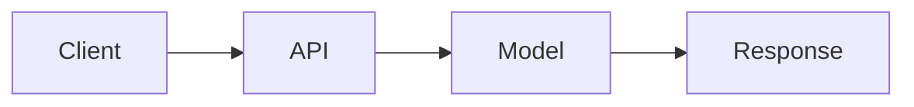

# ════════════════════════════════════════════════════════════════════════════════
# MÓDULO 19: DOCUMENTACIÓN Y ÉTICA
# MkDocs, Model Cards y Responsible AI
# Guía MLOps v5.0: Senior Edition | DuqueOM | Noviembre 2025
# ════════════════════════════════════════════════════════════════════════════════

<div align="center">

# 📚 MÓDULO 19: Documentación y Ética

### Tu Trabajo No Existe Si No Está Documentado

*"La documentación es el regalo que le haces a tu yo del futuro."*

| Duración             | Teoría               | Práctica             |
| :------------------: | :------------------: | :------------------: |
| **4-5 horas**        | 30%                  | 70%                  |

</div>

---

<a id="00-prerrequisitos"></a>

## 0.0 Prerrequisitos

- Haber completado el módulo 18 (Infraestructura) para entender despliegue, entornos y artefactos.
- Saber escribir Markdown básico (headers, listas, links, code fences).
- Entender que la documentación es parte del producto: se versiona, se prueba y se despliega.

---

<a id="01-protocolo-e-como-estudiar-este-modulo"></a>

## 0.1 🧠 Protocolo E: Cómo estudiar este módulo

- **Antes de empezar**: define tu “mínimo viable” (README + Model Card + un sitio de docs o estructura en `docs/`).
- **Durante**: por cada sección (MkDocs, Model Card, Responsible AI), produce un artefacto real en tu repo.
- **Si te atoras >15 min** (MkDocs no compila, links rotos, README desactualizado), regístralo en el **[Diario de Errores](study_tools/DIARIO_ERRORES.md)** y aplica el flujo de **[Protocolo E](study_tools/PROTOCOLO_E.md)**.

---

<a id="02-entregables-verificables-minimo-viable"></a>

## 0.2 ✅ Entregables verificables (mínimo viable)

- [ ] Tu `README` tiene un `Quick Start` que funciona en una máquina limpia.
- [ ] Tienes una **Model Card** completa (propósito, datos, métricas, limitaciones, mantenimiento).
- [ ] Puedes ejecutar `mkdocs serve` (o equivalente) y navegar la documentación localmente.
- [ ] Incluyes al menos un checklist de Responsible AI (fairness, privacidad, accountability).

---

<a id="03-puente-teoria-codigo-portafolio"></a>

## 0.3 🧩 Puente teoría ↔ código (Portafolio)

- **MkDocs**: convierte tu repo en un producto navegable (arquitectura, API, runbooks, decisiones).
- **Model Card**: convierte tu modelo en un “contrato” (qué hace, con qué datos, qué no hace, cómo mantenerlo).
- **Responsible AI**: convierte ética en proceso (checklists en PRs, releases, revisiones de cambios).

---

## 📋 Contenido

- **0.0** [Prerrequisitos](#00-prerrequisitos)
- **0.1** [Protocolo E: Cómo estudiar este módulo](#01-protocolo-e-como-estudiar-este-modulo)
- **0.2** [Entregables verificables (mínimo viable)](#02-entregables-verificables-minimo-viable)
- **0.3** [Puente teoría ↔ código (Portafolio)](#03-puente-teoria-codigo-portafolio)
- **19.1** [MkDocs con Material Theme](#191-mkdocs-con-material-theme)
- **19.2** [Model Card Profesional](#192-model-card-profesional)
- **19.3** [Responsible AI Checklist](#193-responsible-ai-checklist)
- **19.4** [README Profesional](#194-readme-profesional)
- **19.5** [Ejercicio: Crea Tu Documentación](#195-ejercicio-crea-tu-documentacion)
- [Errores habituales](#errores-habituales)
- [✅ Ejercicio](#ejercicio)
- [<a id="checkpoint"></a>

✅ Checkpoint](#checkpoint)

## 🎯 Lo Que Lograrás

1. **Crear** documentación técnica con MkDocs
2. **Escribir** Model Cards profesionales
3. **Implementar** prácticas de Responsible AI
4. **Publicar** docs en GitHub Pages

---

<a id="191-mkdocs-con-material-theme"></a>


### 🧠 Mapa Mental de Conceptos

**Términos clave para este módulo:**
- Revisa los conceptos principales en las secciones siguientes
- Practica con los ejercicios del portafolio BankChurn
- Aplica los checkpoints para verificar tu comprensión

---


### 💻 Ejercicio Puente: Docs

> **Meta**: Practica el concepto antes de aplicarlo al portafolio.

**Ejercicio básico:**
1. Lee la sección teórica siguiente
2. Identifica los patrones clave del código de ejemplo
3. Replica el patrón en un proyecto de prueba

---

### 🛠️ Práctica del Portafolio: Documentación en BankChurn

> **Tarea**: Aplicar este módulo en BankChurn-Predictor.

```bash
cd BankChurn-Predictor
# Explora el código relacionado con Docs
```

**Checklist:**
- [ ] Localicé el código relevante
- [ ] Entendí la implementación actual
- [ ] Identifiqué posibles mejoras

---

### <a id="checkpoint"></a>

✅ Checkpoint de Conocimiento

**Pregunta 1**: ¿Cuál es el objetivo principal de Documentación?

**Pregunta 2**: ¿Cómo se implementa en el portafolio?

**🔧 Escenario Debugging**: Si algo falla en Docs, ¿cuál sería tu primer paso de diagnóstico?


## 19.1 MkDocs con Material Theme

### Estructura de Docs

```
docs/
├── index.md                # Home
├── getting-started/
│   ├── installation.md
│   ├── quickstart.md
│   └── configuration.md
├── architecture/
│   ├── overview.md
│   ├── data-flow.md
│   └── decisions.md
├── api/
│   ├── endpoints.md
│   └── schemas.md
├── development/
│   ├── contributing.md
│   └── testing.md
└── model/
    └── model-card.md

mkdocs.yml                  # Configuración
```

### mkdocs.yml

```yaml
site_name: BankChurn Predictor          # Nombre del sitio en el header.
site_description: API para predicción de churn bancario  # Meta description para SEO.
site_author: Tu Nombre
site_url: https://username.github.io/bankchurn  # URL base del sitio publicado.

theme:
  name: material                        # Material for MkDocs: tema moderno y responsive.
  language: es                          # Idioma de la UI.
  palette:                              # Colores del tema (toggle light/dark).
    - scheme: default                   # Modo claro.
      primary: indigo                   # Color primario.
      accent: indigo                    # Color de acentos (links, botones).
      toggle:
        icon: material/brightness-7     # Icono del toggle.
        name: Cambiar a modo oscuro
    - scheme: slate                     # Modo oscuro.
      primary: indigo
      accent: indigo
      toggle:
        icon: material/brightness-4
        name: Cambiar a modo claro
  features:                             # Features del tema Material.
    - navigation.tabs                   # Tabs en el header para secciones.
    - navigation.sections               # Secciones colapsables en sidebar.
    - navigation.expand                 # Expande subsecciones automáticamente.
    - search.suggest                    # Autocompletado en búsqueda.
    - content.code.copy                 # Botón para copiar código.
    - content.tabs.link                 # Sincroniza tabs entre páginas.

nav:                                    # Estructura de navegación del sitio.
  - Home: index.md
  - Getting Started:                    # Sección con subpáginas.
    - Instalación: getting-started/installation.md
    - Quick Start: getting-started/quickstart.md
    - Configuración: getting-started/configuration.md
  - Arquitectura:
    - Overview: architecture/overview.md
    - Flujo de Datos: architecture/data-flow.md
    - Decisiones: architecture/decisions.md
  - API Reference:
    - Endpoints: api/endpoints.md
    - Schemas: api/schemas.md
  - Desarrollo:
    - Contribuir: development/contributing.md
    - Testing: development/testing.md
  - Model Card: model/model-card.md

markdown_extensions:                    # Extensiones de Markdown adicionales.
  - pymdownx.highlight:                 # Syntax highlighting para código.
      anchor_linenums: true             # Links a líneas específicas.
  - pymdownx.superfences:               # Bloques de código avanzados.
      custom_fences:
        - name: mermaid                 # Soporte para diagramas Mermaid.
          class: mermaid
          format: !!python/name:pymdownx.superfences.fence_code_format
  - pymdownx.tabbed:                    # Tabs dentro del contenido.
      alternate_style: true
  - admonition                          # Boxes de nota/warning/tip.
  - pymdownx.details                    # Secciones colapsables.
  - attr_list                           # Atributos HTML en Markdown.
  - md_in_html                          # Markdown dentro de HTML.
  - tables                              # Tablas Markdown.

plugins:
  - search                              # Búsqueda integrada.
  - mkdocstrings:                       # Auto-documentación desde docstrings.
      handlers:
        python:
          options:
            show_source: true           # Muestra código fuente en docs.

extra:
  social:                               # Links a redes sociales en footer.
    - icon: fontawesome/brands/github
      link: https://github.com/username/bankchurn
```

### Comandos MkDocs

```bash
# Instalar
pip install mkdocs mkdocs-material mkdocstrings[python]  # mkdocs-material: tema popular. mkdocstrings: autodoc de Python.

# Desarrollo local
mkdocs serve                          # Inicia servidor en localhost:8000 con hot-reload.

# Build
mkdocs build                          # Genera HTML estático en carpeta site/.

# Deploy a GitHub Pages
mkdocs gh-deploy                      # Construye y hace push a branch gh-pages automáticamente.
```

---

<a id="192-model-card-profesional"></a>

## 19.2 Model Card Profesional

```markdown
# Model Card: BankChurn Predictor

## Información del Modelo

| Campo | Valor |
|-------|-------|
| **Nombre** | BankChurn Predictor |
| **Versión** | 1.2.3 |
| **Tipo** | Clasificación Binaria |
| **Framework** | Scikit-learn 1.3.0 |
| **Fecha de Entrenamiento** | 2024-01-15 |
| **Autor** | Tu Nombre |

## Propósito

### Uso Previsto
- **Caso de uso principal**: Identificar clientes con alta probabilidad de abandonar el banco
- **Usuarios objetivo**: Equipo de Retención de Clientes
- **Decisiones habilitadas**: Campañas de retención personalizadas

### Uso No Previsto
- ❌ No usar para decisiones crediticias
- ❌ No usar como único criterio para cancelar servicios
- ❌ No usar en mercados fuera de Europa (entrenado solo con datos de FR/DE/ES)

## Datos de Entrenamiento

### Dataset
- **Fuente**: Sistema CRM interno
- **Período**: 2022-01-01 a 2023-12-31
- **Tamaño**: 10,000 registros
- **Split**: 80% train, 20% test (estratificado)

### Features
| Feature | Tipo | Descripción |
|---------|------|-------------|
| CreditScore | Numérica | Score crediticio (300-850) |
| Age | Numérica | Edad del cliente |
| Geography | Categórica | País (France, Germany, Spain) |
| ... | ... | ... |

### Distribución del Target
- **Churn (1)**: 20%
- **No Churn (0)**: 80%
- **Estrategia**: class_weight='balanced'

## Métricas de Performance

### Métricas Globales
| Métrica | Train | Test | Threshold |
|---------|-------|------|-----------|
| AUC-ROC | 0.89 | 0.87 | > 0.85 ✅ |
| Precision | 0.72 | 0.68 | > 0.60 ✅ |
| Recall | 0.78 | 0.74 | > 0.70 ✅ |
| F1 | 0.75 | 0.71 | > 0.65 ✅ |

### Métricas por Subgrupo (Fairness)
| Subgrupo | AUC-ROC | Precision | Recall |
|----------|---------|-----------|--------|
| Gender: Male | 0.86 | 0.67 | 0.73 |
| Gender: Female | 0.88 | 0.69 | 0.75 |
| Geography: France | 0.87 | 0.68 | 0.74 |
| Geography: Germany | 0.85 | 0.66 | 0.72 |
| Geography: Spain | 0.88 | 0.70 | 0.76 |

**Nota**: La diferencia máxima de AUC entre subgrupos es 0.03 (< 0.05 threshold).

## Limitaciones

### Limitaciones Conocidas
1. **Temporal**: Modelo entrenado con datos hasta 2023. Puede degradarse con cambios económicos.
2. **Geográfico**: Solo válido para Francia, Alemania y España.
3. **Demográfico**: Menos preciso para clientes < 25 años (pocos datos).

### Cuándo NO Usar
- Datos con > 30% de valores faltantes
- Clientes corporativos (solo entrenado con personas físicas)
- Períodos de crisis económica (cambio de distribución)

## Consideraciones Éticas

### Fairness
- Se monitorean métricas por género y geografía
- Diferencias de performance < 5% entre grupos
- No se usan features protegidas directamente (pero Geography correlaciona con cultura)

### Privacidad
- Datos pseudonimizados (no PII en features)
- Cumple con GDPR (Art. 22 - derecho a explicación)
- Retención de datos: 24 meses

### Transparencia
- SHAP values disponibles para explicabilidad
- Documentación de limitaciones pública
- Proceso de feedback habilitado

## Mantenimiento

### Monitoreo
- Data drift monitoreado diariamente (Evidently)
- Alerta si drift > 10%
- Performance evaluada mensualmente con ground truth

### Retraining
- **Frecuencia**: Trimestral o si drift detectado
- **Proceso**: Automatizado vía GitHub Actions
- **Aprobación**: Requiere validación de Data Science Lead

## Historial de Versiones

| Versión | Fecha | Cambios | AUC |
|---------|-------|---------|-----|
| 1.0.0 | 2023-06-01 | Versión inicial | 0.82 |
| 1.1.0 | 2023-09-01 | Feature engineering | 0.85 |
| 1.2.0 | 2024-01-01 | Retraining con datos 2023 | 0.87 |
| 1.2.3 | 2024-01-15 | Fix en preprocessing | 0.87 |

## Contacto

- **Responsable**: tu.email@company.com
- **Equipo**: ML Platform Team
- **Escalación**: data-ethics@company.com
```

---

<a id="193-responsible-ai-checklist"></a>

## 19.3 Responsible AI Checklist

```
╔═══════════════════════════════════════════════════════════════════════════════╗
║                    CHECKLIST DE RESPONSIBLE AI                                ║
╠═══════════════════════════════════════════════════════════════════════════════╣
║                                                                               ║
║   FAIRNESS:                                                                   ║
║   [ ] Métricas calculadas por subgrupos demográficos                          ║
║   [ ] Diferencias de performance < 5% entre grupos                            ║
║   [ ] Features sensibles identificadas y documentadas                         ║
║   [ ] Estrategia de mitigación si hay sesgo                                   ║
║                                                                               ║
║   TRANSPARENCIA:                                                              ║
║   [ ] Model Card completo y público                                           ║
║   [ ] Explicabilidad disponible (SHAP/LIME)                                   ║
║   [ ] Limitaciones claramente documentadas                                    ║
║   [ ] Usuarios saben que interactúan con ML                                   ║
║                                                                               ║
║   PRIVACIDAD:                                                                 ║
║   [ ] No PII en features                                                      ║
║   [ ] Cumplimiento GDPR/CCPA documentado                                      ║
║   [ ] Política de retención de datos                                          ║
║   [ ] Proceso de eliminación de datos                                         ║
║                                                                               ║
║   ACCOUNTABILITY:                                                             ║
║   [ ] Responsable del modelo identificado                                     ║
║   [ ] Proceso de escalación definido                                          ║
║   [ ] Auditoría periódica programada                                          ║
║   [ ] Canal de feedback para usuarios                                         ║
║                                                                               ║
╚═══════════════════════════════════════════════════════════════════════════════╝
```

---

<a id="194-readme-profesional"></a>

## 19.4 README Profesional

```markdown
# 🏦 BankChurn Predictor

[](https://github.com/username/bankchurn/actions)
[](https://codecov.io/gh/username/bankchurn)
[](LICENSE)
[](https://python.org)

> API para predicción de churn bancario con MLOps completo.

## 🚀 Quick Start

```bash
# Clonar
git clone https://github.com/username/bankchurn.git
cd bankchurn

# Instalar
pip install -e ".[dev]"

# Ejecutar tests
pytest

# Iniciar API
uvicorn app.main:app --reload
```

## 📖 Documentation

- [Documentación Completa](https://username.github.io/bankchurn)
- [API Reference](https://username.github.io/bankchurn/api/endpoints)
- [Model Card](https://username.github.io/bankchurn/model/model-card)

## 🏗️ Architecture



## 📊 Metrics

| Metric | Value |
|--------|-------|
| AUC-ROC | 0.87 |
| Latency P99 | 45ms |
| Coverage | 85% |

## 📜 License

MIT © Tu Nombre
```

---

## 🧨 Errores habituales y cómo depurarlos en documentación ML {#errores-habituales}

La documentación suele quedarse para el final, y eso genera READMEs desactualizados y Model Cards incompletas.

Si alguno de estos errores te tomó **>15 minutos**, regístralo en el **[Diario de Errores](study_tools/DIARIO_ERRORES.md)** y aplica el flujo de **rescate cognitivo** de **[Protocolo E](study_tools/PROTOCOLO_E.md)**.

### 1) README que no refleja el estado real del proyecto

**Síntomas típicos**

- Instrucciones de instalación que no funcionan.
- Comandos de entrenamiento/serve diferentes a los reales.

**Cómo identificarlo**

- Intenta seguir tu propio `Quick Start` desde cero en una máquina limpia.

**Cómo corregirlo**

- Actualiza el README cada vez que cambies la CLI, el Makefile o los entornos.
- Copia los comandos reales desde tu `Makefile` o scripts, no los escribas de memoria.

---

### 2) Model Card incompleta o decorativa

**Síntomas típicos**

- Hay secciones de plantilla sin rellenar o con texto genérico.
- No hay detalles de datos, métricas por subgrupo ni limitaciones claras.

**Cómo identificarlo**

- Compara tu Model Card con el ejemplo de este módulo: ¿faltan tablas clave o secciones enteras?

**Cómo corregirlo**

- Completa al menos: propósito, datos, métricas principales, métricas por subgrupos, limitaciones y plan de mantenimiento.

---

### 3) MkDocs que compila pero no se integra en el flujo

**Síntomas típicos**

- `mkdocs serve` funciona, pero nadie sabe la URL de docs en el README o en el repo.

**Cómo identificarlo**

- Revisa si tu README enlaza a la documentación generada.

**Cómo corregirlo**

- Añade enlaces claros en el README (sección Documentation) y en la descripción del repositorio.

---

### 4) Responsible AI checklist ignorada

**Síntomas típicos**

- El checklist de Responsible AI está en el repo, pero nunca se usa en revisiones.

**Cómo identificarlo**

- Pregunta: ¿se revisan fairness, privacidad y accountability en los PRs importantes?

**Cómo corregirlo**

- Integra partes del checklist en tu proceso de revisión (por ejemplo, una sección en la PR template).

---

### 5) Patrón general de debugging en documentación

1. Usa tu propia documentación como si fueras un usuario nuevo (installation, quick start).
2. Mantén un lugar único de verdad para comandos y rutas (Makefile, docs técnicas) y enlázalo desde el README.
3. Considera la Model Card como parte del contrato del modelo, no como adorno.

Con esta mentalidad, tu documentación pasa de ser un "nice to have" a convertirse en una parte crítica de la calidad de tu sistema ML.

---

## 19.5 Ejercicio: Crea Tu Documentación {#195-ejercicio-crea-tu-documentacion}

### Checklist

```
MKDOCS:
[ ] mkdocs.yml configurado
[ ] Home page con overview
[ ] Getting started completo
[ ] API documentada

MODEL CARD:
[ ] Información del modelo
[ ] Datos de entrenamiento
[ ] Métricas de performance
[ ] Limitaciones y ética

README:
[ ] Badges de CI/Coverage
[ ] Quick Start
[ ] Links a docs
[ ] Arquitectura visual
```

---

## 📹 Material Audiovisual

Para crear demos profesionales (GIFs, screenshots, videos) de tu documentación y portafolio, consulta:

**[→ Guía Audiovisual Completa](GUIA_AUDIOVISUAL.md)**

Incluye:
- Cómo grabar GIFs demostrativos de APIs y dashboards
- Screenshots profesionales para README
- Video de 5 minutos explicando el portafolio
- Scripts y comandos para levantar el stack demo

---

## 💼 Consejos Profesionales

> **Recomendaciones para destacar en entrevistas y proyectos reales**

### Para Entrevistas

1. **Model Cards**: Explica por qué documentar limitaciones y sesgos es crítico.

2. **Documentation as Code**: Docs versionados junto al código.

3. **Audience-aware**: Diferentes docs para diferentes audiencias.

### Para Proyectos Reales

| Documento | Audiencia | Contenido |
|-----------|-----------|-----------|
| README.md | Todos | Quick start, overview |
| Model Card | ML team, stakeholders | Métricas, limitaciones, ética |
| API Docs | Developers | Endpoints, schemas, ejemplos |
| Runbook | Ops | Troubleshooting, alertas |

### Documentación que Diferencia

- **ADRs**: Decisiones arquitectónicas con contexto
- **Changelogs**: Generados automáticamente desde commits
- **Diagramas**: Mermaid/PlantUML versionados
- **Ejemplos**: Notebooks con casos de uso reales


---

## 📺 Recursos Externos Recomendados

> Ver [RECURSOS_POR_MODULO.md](RECURSOS_POR_MODULO.md) para la lista completa.

## 📺 Recursos Externos del Módulo

> 🏷️ Sistema: 🔴 Obligatorio | 🟡 Recomendado | 🟢 Complementario

### 🎬 Videos

| 🏷️ | Título | Canal | Duración | Link |
|:--:|:-------|:------|:--------:|:-----|
| 🔴 | **MkDocs Tutorial** | James Willett | 30 min | [YouTube](https://www.youtube.com/watch?v=Q-YA_dA8C20) |
| 🟡 | **Model Cards for ML** | Google | 15 min | [Google](https://modelcards.withgoogle.com/about) |

### 📄 Documentación

| 🏷️ | Recurso | Descripción |
|:--:|:--------|:------------|
| 🔴 | [Model Cards](https://modelcards.withgoogle.com/) | Estándar de Google |
| 🟡 | [MkDocs Material](https://squidfunk.github.io/mkdocs-material/) | Tema MkDocs |

---

## 🔧 Ejercicios del Módulo

### Ejercicio 19.1: Model Card
**Objetivo**: Documentar modelo ML con Model Card.
**Dificultad**: ⭐⭐

```markdown
# TU TAREA: Completar Model Card para BankChurn

## Model Details
- Owner: ???
- Version: ???
- Type: ???

## Intended Use
- Primary: ???
- Out-of-scope: ???

## Training Data
- Source: ???
- Size: ???

## Evaluation
- Metrics: ???
- Performance: ???

## Limitations
- ???
```

<details>
<summary>💡 Ver solución</summary>

```markdown
# Model Card: BankChurn Predictor

## Model Details
- **Owner**: ML Team
- **Version**: 1.2.0 (2024-01)
- **Type**: Binary Classification (Random Forest)
- **License**: MIT
- **Contact**: ml-team@company.com

## Intended Use
- **Primary**: Predecir probabilidad de churn de clientes bancarios
- **Users**: Equipo de retención, marketing
- **Out-of-scope**: Decisiones automatizadas de crédito, scoring financiero

## Training Data
- **Source**: CRM interno (2020-2023)
- **Size**: 10,000 clientes, 50,000 transacciones
- **Features**: age, tenure, balance, num_products, geography
- **Target**: churned (binary, 30-day window)

## Evaluation
| Metric | Train | Test | Threshold |
|--------|-------|------|-----------|
| F1 | 0.82 | 0.78 | ≥ 0.75 |
| Recall | 0.85 | 0.80 | ≥ 0.80 |
| AUC | 0.91 | 0.87 | ≥ 0.85 |

## Ethical Considerations
- No usa datos demográficos sensibles (race, gender)
- Modelo explicable con SHAP
- Human-in-the-loop para acciones de retención

## Limitations
- Performance menor en clientes nuevos (tenure < 6 meses)
- No captura eventos macroeconómicos
- Requiere actualización trimestral

## Maintenance
- **Retrain**: Trimestral o si AUC < 0.80
- **Monitoring**: Drift detection semanal
- **Owner**: ML Team
```
</details>

---

## 🔗 Glosario del Módulo

| Término | Definición |
|---------|------------|
| **Model Card** | Documento estandarizado que describe un modelo ML |
| **Dataset Card** | Documentación de dataset (fuente, schema, limitaciones) |
| **MkDocs** | Generador de sitios de documentación desde Markdown |
| **Responsible AI** | Prácticas para desarrollo ético de sistemas ML |

---

<div align="center">

**Siguiente módulo** → [20. Observabilidad Avanzada](20_OBSERVABILIDAD_AVANZADA_DRIFT.md)

---

[← Volver al Índice](00_INDICE.md)

</div>
